# さんすうブロック つかいかた

このページは、さんすうブロックを はじめて ひらく人の ための つかいかたです。<ruby>画面<rt>がめん</rt></ruby>の <ruby>絵<rt>え</rt></ruby>と 見くらべながら、上から じゅんに <ruby>読<rt>よ</rt></ruby>んでください。

## さんすうブロックで できること（つかう人と <ruby>用意<rt>ようい</rt></ruby>する もの）

ここでは、この アプリで <ruby>何<rt>なに</rt></ruby>が できるのかと、はじめる まえに <ruby>用意<rt>ようい</rt></ruby>する ものを <ruby>説明<rt>せつめい</rt></ruby>します。

### さんすうブロックとは？

ブラウザで ひらくだけで つかえる、けいさんの れんしゅう アプリです。「くりあがりの ある たしざん」と「くりさがりの ある ひきざん」を、さんすうブロックと さくらんぼの <ruby>絵<rt>え</rt></ruby>で 目に 見える かたちに して かんがえます。

こたえを 入れるだけの アプリでは ありません。ブロックを じぶんの 手で タップして うごかしてから こたえます。

つかうのは 小学校の 1年生です。先生や おうちの人と いっしょでも、ひとりでも つかえます。名まえも 出せきばんごうも 入れる ところが ありません。

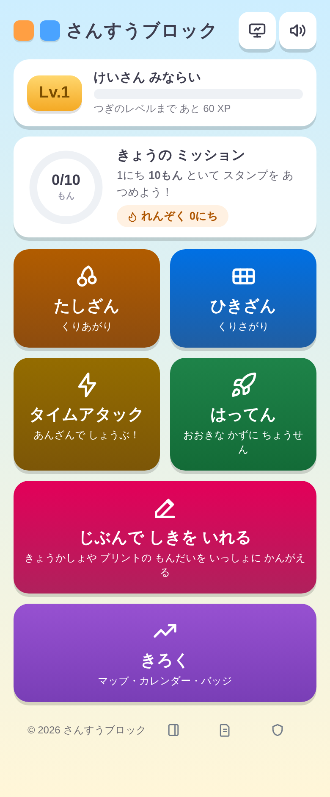

これが ホームの <ruby>画面<rt>がめん</rt></ruby>です。ここから ぜんぶ はじまります。

### つかう まえに <ruby>用意<rt>ようい</rt></ruby>する もの

<ruby>用意<rt>ようい</rt></ruby>する ものは、つぎの 3つだけです。

- タブレットか パソコン（Chromebook・iPad・Windows の どれでも うごきます）
- インターネットに つながる こと（さいしょの 1<ruby>回<rt>かい</rt></ruby>だけ ひつようです）
- ひらく ところ（アドレス）… `https://keisan-block.giga-school.com/`

ID・パスワード・メールアドレスは いりません。アプリを ダウンロードする ひつようも ありません。

【！】<ruby>覚<rt>おぼ</rt></ruby>えておいて ほしいこと:

- 音が 出ます。<ruby>教室<rt>きょうしつ</rt></ruby>で みんなが つかう ときは、さきに 音を けして ください。けしかたは この つぎの <ruby>章<rt>しょう</rt></ruby>に あります。
- 1年生が ひとりで <ruby>読<rt>よ</rt></ruby>めるように、アプリの 中の 字は ぜんぶ ひらがなです。

### どんな しきが 出るか

出て くる しきは、えらんだ ボタンごとに きまって います。

- たしざん … 6＋5 から 9＋9 まで。くりあがりの ある 26とおり
- ひきざん … 11−2 から 18−9 まで。くりさがりの ある 36とおり
- タイムアタック … 上の 26とおりと 36とおりから、たしざんと ひきざんを はんぶんずつ
- はってんの たしざん … 22＋… から 79＋… まで。かならず くりあがります
- はってんの ひきざん … 21−… から 78−… まで。かならず くりさがります
- じぶんで しきを いれる … じぶんで 入れた しき（2けた ± 2けた まで）

おなじ しきが つづけて 出ないように なって います。そのうえで、1<ruby>回<rt>かい</rt></ruby>でも といた ことが あって まだ「ばっちり」に なって いない けいさんカードが、35パーセントぐらいの わりあいで えらばれます。にがてな ところほど よく 出ます。

## はじめて ひらいた ときに すること（インストール・さいしょの 1<ruby>回<rt>かい</rt></ruby>だけ）

ここに <ruby>書<rt>か</rt></ruby>いて あるのは、さいしょの 1<ruby>回<rt>かい</rt></ruby>だけ やる ことです。2<ruby>回<rt>かい</rt></ruby>めからは、アドレスを ひらくだけで はじめられます。

### アプリを ひらく

さいしょの 手じゅんは これだけです。

1. ブラウザ（Chrome や Safari）を ひらいて ください。
2. アドレスの ところに `https://keisan-block.giga-school.com/` と 入れて ください。
3. さんすうブロックの ホームの <ruby>画面<rt>がめん</rt></ruby>が 出たら、じゅんびは おわりです。

ログインも、アカウントの とうろくも いりません。「ログインして ください」という <ruby>画面<rt>がめん</rt></ruby>は 出ません。

### タブレットや パソコンに アプリを 入れる

1<ruby>回<rt>かい</rt></ruby> 入れて おくと、アイコンから すぐ ひらけます。インターネットが つながって いなくても つかえます。

Chromebook・Windows（Chrome や Edge）で 入れる 手じゅん:

1. ホームの <ruby>画面<rt>がめん</rt></ruby>を いちばん下まで ながして ください。
2. 「アプリを インストール」の ボタンを おして ください。
3. 出て きた まどの「インストール」を おして ください。

【！】<ruby>覚<rt>おぼ</rt></ruby>えておいて ほしいこと:

- 「アプリを インストール」の ボタンは、いつも 出て いる わけでは ありません。もう 入れた あとや、ブラウザが「入れられる」と はんだんして いない ときは 出ません。
- ボタンが 出ない ときは、ブラウザの メニュー（右上の <ruby>点<rt>てん</rt></ruby>が 3つ ならんだ ところ）から 入れて ください。
- iPad と iPhone には、この ボタンは 出ません。つぎの やりかたで 入れて ください。

### iPad・iPhone で ホーム<ruby>画面<rt>がめん</rt></ruby>に ついかする

1. かならず Safari で ひらいて ください。Safari いがいの ブラウザからは ついか できません。
2. <ruby>画面<rt>がめん</rt></ruby>の 下（か 右上）に ある「きょうゆう」の ボタン（四かくに 上むきの やじるしの <ruby>絵<rt>え</rt></ruby>）を おして ください。
3. ならんで いる 中から「ホーム<ruby>画面<rt>がめん</rt></ruby>に <ruby>追加<rt>ついか</rt></ruby>」を えらんで ください。
4. 右上の「<ruby>追加<rt>ついか</rt></ruby>」を おして ください。ホーム<ruby>画面<rt>がめん</rt></ruby>に アイコンが できます。

### 音を 出す・音を けす

ホームの <ruby>画面<rt>がめん</rt></ruby>の 右上に、ボタンが 2つ ならんで います。右が 音の ボタンです。

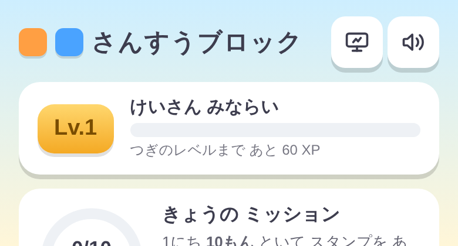

左が 大きく うつす ボタン、右が 音の ボタンです。

1. スピーカーの <ruby>絵<rt>え</rt></ruby>の ボタンを おすと、音が けせます。
2. もう 1<ruby>回<rt>かい</rt></ruby> おすと、また 音が 出ます。

【！】<ruby>覚<rt>おぼ</rt></ruby>えておいて ほしいこと:

- きめた ことは のこります。つぎに ひらいた ときも、けした ままです。
- れんしゅうの <ruby>画面<rt>がめん</rt></ruby>の 右上にも おなじ ボタンが あるので、とちゅうでも けせます。

## ホームの <ruby>画面<rt>がめん</rt></ruby>の みかた（どこに <ruby>何<rt>なに</rt></ruby>が あるか）

ホームの <ruby>画面<rt>がめん</rt></ruby>には、上から じゅんに レベル・きょうの ミッション・6つの ボタン・リンクが ならんで います。

### レベルと XP の みかた

いちばん上の 白い カードが レベルです。

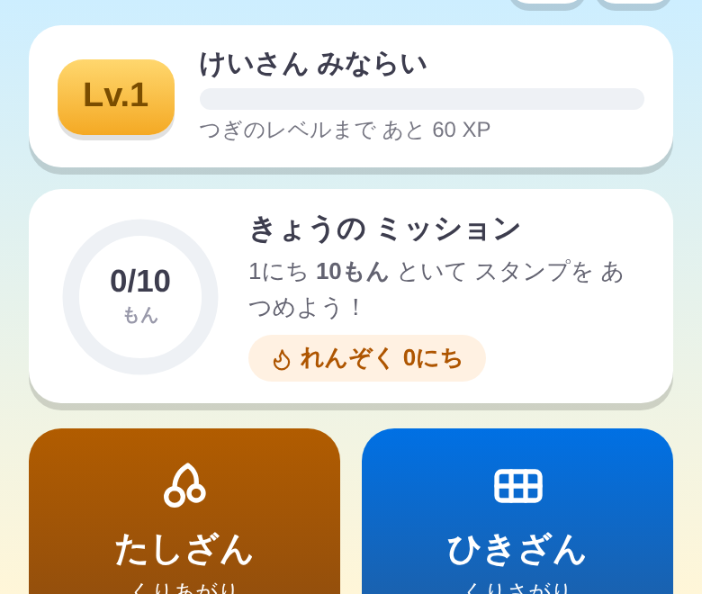

上が レベル、下が きょうの ミッションです。

1もん とくたびに XP が たまり、たまると レベルが 1つ 上がります。よび名も 「けいさん みならい」から はじまって、「けいさん れんしゅうちゅう」「けいさん がんばりや」「けいさん じょうずさん」「けいさん はかせ」「けいさん めいじん」「けいさん マスター」と 7だんかいに かわって いきます。

もらえる XP は、1<ruby>回<rt>かい</rt></ruby>めで せいかいすると おおく なります。ふつうの もんだいは 10 XP（とちゅうで まちがえた ときは 5 XP）、はってんの もんだいは 15 XP（おなじく 8 XP）、タイムアタックは 8 XP です。

### きょうの ミッションと、つづけて れんしゅうした 日

2つめの カードが きょうの ミッションです。1にちに 10もん とくと たっせいです。

まるい わの 中の「0/10」が、きょう といた <ruby>数<rt>かず</rt></ruby>です。10もん とくと「クリア!」に かわり、カレンダーに <ruby>星<rt>ほし</rt></ruby>の スタンプが つきます。

その下の「れんぞく ◯にち」は、なん日 つづけて れんしゅうしたかです。1日 やすむと 0に もどります。

### 6つの ボタンから えらぶ

カードの 下に、6つの ボタンが ならんで います。この 6つが、この アプリで できる こと ぜんぶです。

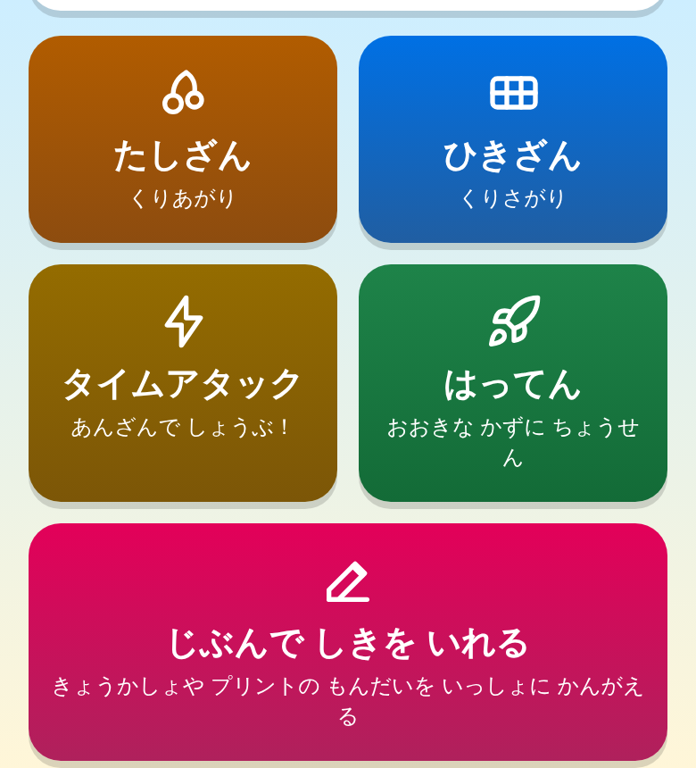

上の 4つと、その下の 2つで、ぜんぶで 6つです。

- たしざん … くりあがりの ある たしざんを 5もん
- ひきざん … くりさがりの ある ひきざんを 5もん
- タイムアタック … あんざんで 10もん。<ruby>時間<rt>じかん</rt></ruby>を はかります
- はってん … 2けたの けいさんを 5もん
- じぶんで しきを いれる … きょうかしょや プリントの しきを 入れて かんがえます
- きろく … これまでの がんばりを 見ます

### <ruby>画面<rt>がめん</rt></ruby>の いちばん下に ある リンク

いちばん下に、小さな しるしが 3つ ならんで います。<ruby>画面<rt>がめん</rt></ruby>が ひろい ときは、しるしの となりに ことばも 出ます。

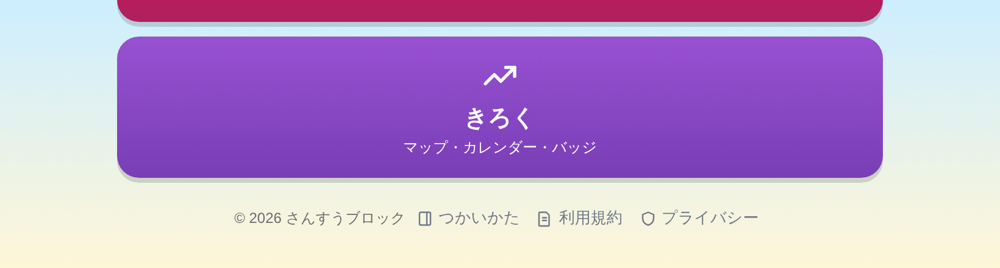

左から「つかいかた」「<ruby>利用規約<rt>りようきやく</rt></ruby>」「プライバシー」です。

いちばん左の「つかいかた」を おすと、いま <ruby>読<rt>よ</rt></ruby>んで いる この ページが ひらきます。こまった ときは、アプリの 中から ここへ もどって これます。

## れんしゅうの <ruby>画面<rt>がめん</rt></ruby>と、ブロックの うごかしかた

たしざん・ひきざん・はってん・じぶんで いれた しきは、どれも おなじ <ruby>画面<rt>がめん</rt></ruby>で すすみます。さきに この <ruby>画面<rt>がめん</rt></ruby>の みかたを おぼえて ください。

### <ruby>画面<rt>がめん</rt></ruby>の どこに <ruby>何<rt>なに</rt></ruby>が あるか

上から じゅんに、<ruby>星<rt>ほし</rt></ruby>の ならび・しき・ブロック・きかれて いる こと・キーパッドの じゅんに ならんで います。

上の <ruby>星<rt>ほし</rt></ruby>は、5もんの うち なんもん とけたかです。

- いちばん上の 左の「＜」… やめて ホームへ もどる
- <ruby>星<rt>ほし</rt></ruby> 5つ … この 5もんの うち なんもん とけたか
- ほのおの しるしの <ruby>数<rt>かず</rt></ruby> … れんぞくで せいかいした <ruby>数<rt>かず</rt></ruby>
- おびの 中の ことば … いま つかって いる さくせんの 名まえ
- まん中の <ruby>絵<rt>え</rt></ruby> … 10の まとまり（オレンジ）と ばら（青）の ブロック
- 下の キーパッド … こたえの すうじを 入れる ところ

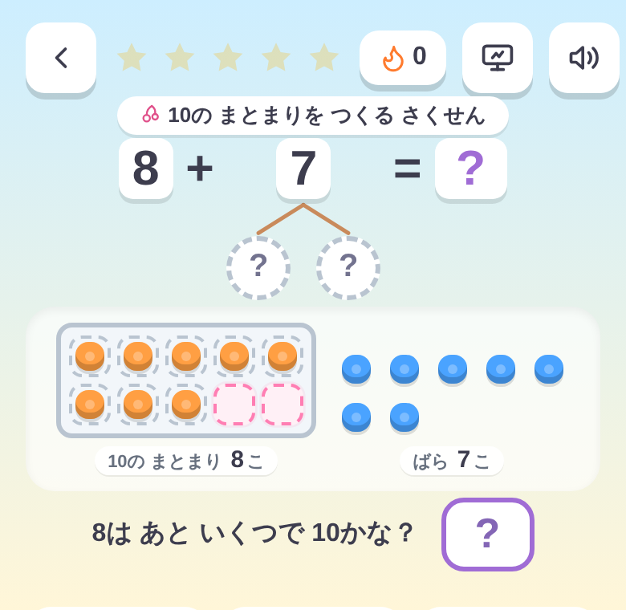

上が「10の まとまり」、下が「ばら」です。

### ブロックを タップして かぞえる

かぞえたい ときは、ブロックを 1つずつ タップして ください。タップした じゅんに 1・2・3… と ばんごうが つきます。

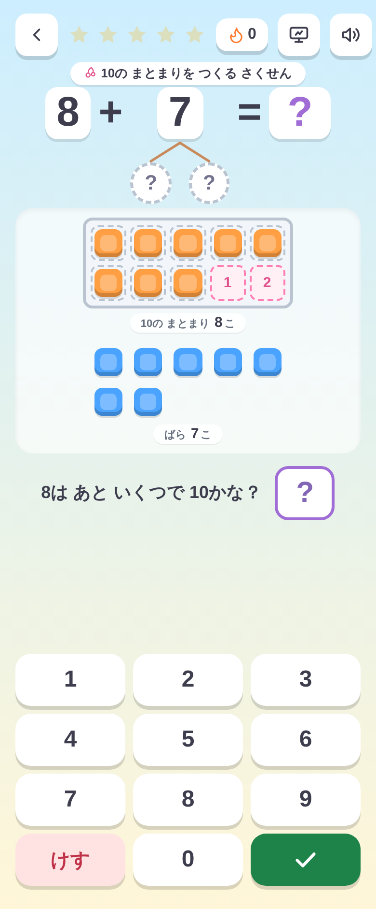

あいて いる ところを 2つ タップしたので、1と 2が つきました。

かぞえまちがえた ときは、ばんごうの ついた ところを もう 1<ruby>回<rt>かい</rt></ruby> タップして ください。ぜんぶ きえて、さいしょから かぞえなおせます。

### ブロックを タップして うごかす

「タップして 10の まとまりに いれよう！」と 出たら、じぶんの 手で ブロックを うごかす ばんです。

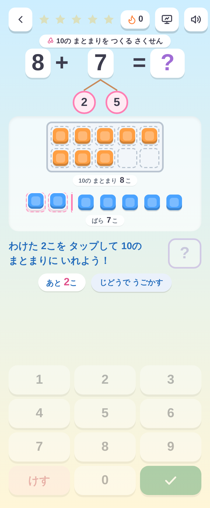

うごかす あいだ、下の キーパッドは うすく なって おやすみします。

- のこりの <ruby>数<rt>かず</rt></ruby>は「あと ◯こ」と 出ます
- 4びょう さわらないで いると、つぎに タップする 1こが 大きく ゆれて おしえて くれます
- ぜんぶ うごかしおわると、キーパッドが また つかえるように なります

### まとめて うごかす（じどうで うごかす）

1つずつ タップしないで まとめて すすめたい ときは、「じどうで うごかす」を おして ください。

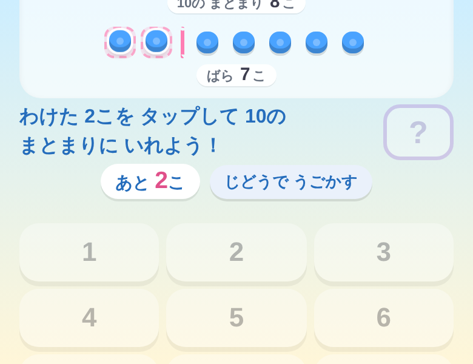

おすと、のこりが ぜんぶ じどうで うごきます。

【！】<ruby>覚<rt>おぼ</rt></ruby>えておいて ほしいこと:

- この ボタンを つかった ことは、がくしゅうの きろくに「てだすけを つかった」と して のこります。ただし「いっぱつせいかい」の <ruby>数<rt>かず</rt></ruby>は へりません。
- こまった ときの ための ボタンです。まずは じぶんの 手で うごかして みて ください。

## くりあがりの たしざんを れんしゅうする

ホームの「たしざん」から はじめます。きょうかしょの「けいさんの しかた」と おなじ 4つの 手じゅんで すすみます。

### たしざんを はじめる

1. ホームの「たしざん」を おして ください。
2. すぐに 1もんめが 出ます。えらぶ ものは ありません。
3. 5もん とくと、おいわいの <ruby>画面<rt>がめん</rt></ruby>が 出ます。

### 4つの 手じゅんで こたえを 出す（8＋7の ばあい）

しきが 8＋7 の ときは、つぎの 4つの 手じゅんで すすみます。

1. 8は あと いくつで 10かな？ … 10の まとまりの あいて いる ところを タップして かぞえて、2 と こたえます。
2. 7を 2と いくつに わけるかな？ … さくらんぼの 右がわを かんがえて、5 と こたえます。

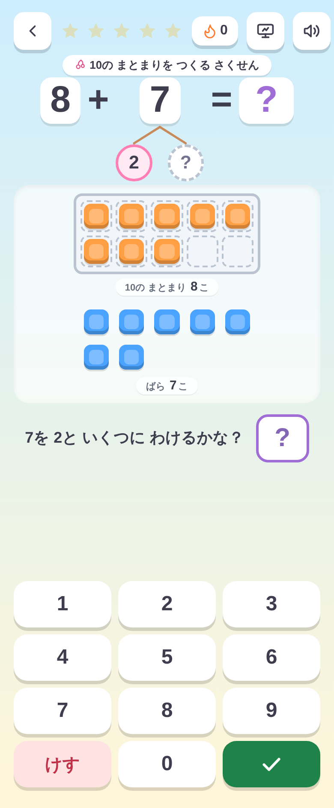

7の 下の さくらんぼに 2と 5が 入りました。

3. わけた 2こを タップして 10の まとまりに いれよう！ … ブロックを 2こ うごかします。うごかしおわると「8に 2を たすと いくつかな？」と きかれるので、10 と こたえます。

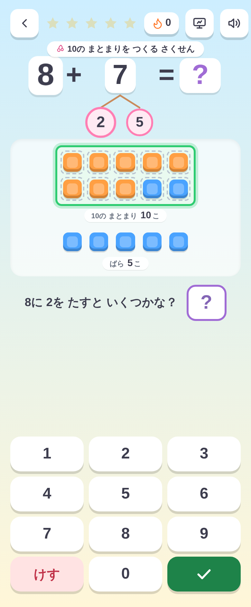

青い ブロックが 2こ 入って、まとまりが 10こに なりました。

4. 10と 5で いくつかな？ … 15 と こたえます。これで 1もん おわりです。

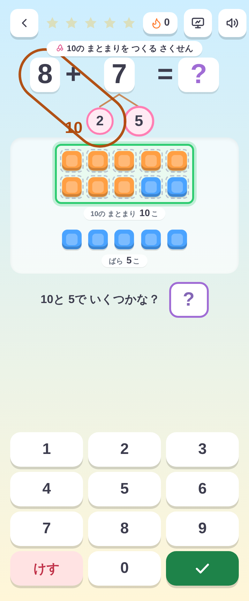

のこった ばらの 5と、10の まとまりを あわせます。

【！】<ruby>覚<rt>おぼ</rt></ruby>えておいて ほしいこと:

- こたえの すうじは、キーパッドを おすと すぐに はんていされます。まちがえて おした ときは「けす」で 入れなおせます。
- 2けたの こたえの ときは、2つめの すうじを 入れた ところで はんていされます。
- タイムアタックだけは、この 4つの 手じゅんが 出ません。こたえだけを きかれます。

## くりさがりの ひきざんを れんしゅうする（さくせんを えらぶ）

ひきざんには かんがえかたが 2つ あります。きょうかしょに よって ならう じゅんが ちがうので、どちらも れんしゅう できます。

### ひきざんを はじめて、さくせんを えらぶ

1. ホームの「ひきざん」を おして ください。
2. 「ひきざんの さくせんを えらぼう」の <ruby>画面<rt>がめん</rt></ruby>が 出ます。
3. 3つの 中から 1つ おすと、すぐに 1もんめが 出ます。

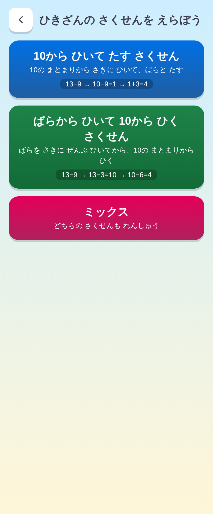

3つの ボタンに 13−9 の ときの れいが 出て います。

### 10から ひいて たす さくせん

13−9 を、10の まとまりから さきに ひいて かんがえる やりかたです。

1. ばらの 3から 9は ひけないね。13を 10と いくつに わけるかな？ … 3 と こたえます。

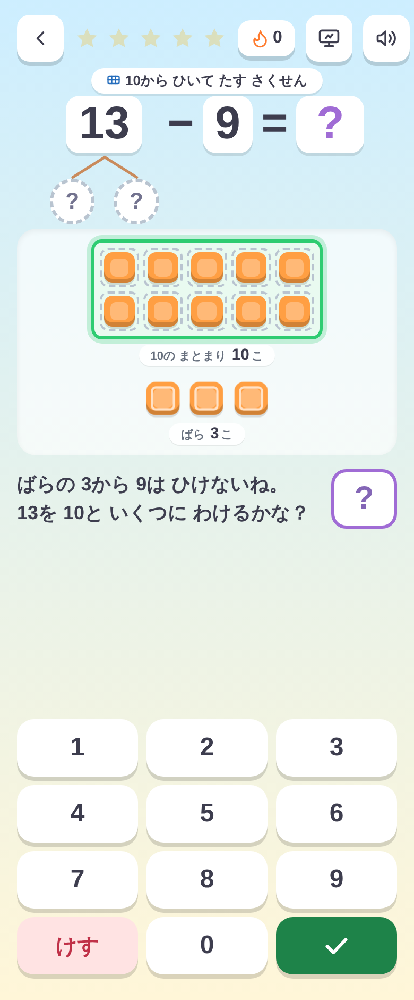

さくらんぼに 10と 3が 入ります。

2. 10の まとまりから ブロックを 9こ タップして とろう！ … 9こ タップします。

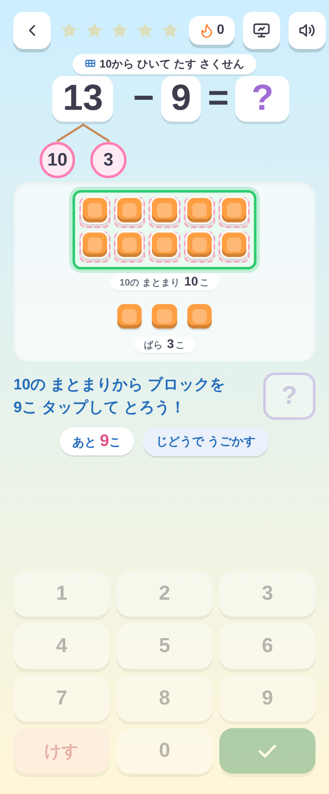

「あと ◯こ」が へって いきます。

3. 10から 9を ひくと いくつかな？ … のこった ブロックを かぞえて、1 と こたえます。
4. のこった 1と 3で いくつかな？ … 4 と こたえます。

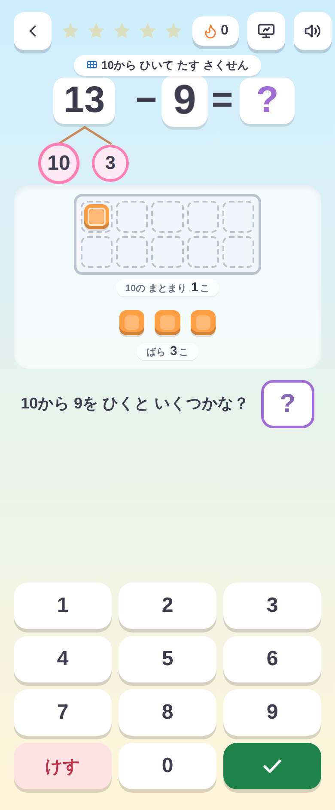

つかった 10には ななめの <ruby>線<rt>せん</rt></ruby>が つきます。

### ばらから ひいて 10から ひく さくせん

おなじ 13−9 を、ばらから さきに ひいて かんがえる やりかたです。

1. ばらの 3から 9は ひけないね。さきに ばらの 3を ひくよ。9を 3と いくつに わけるかな？ … 6 と こたえます。

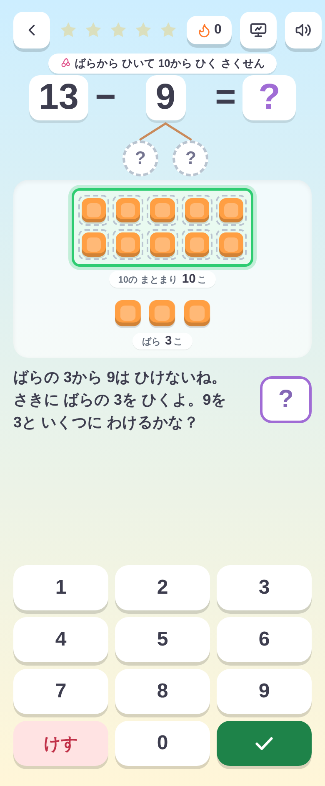

こんどは 9の 下に さくらんぼが つきます。

2. ばらの ブロックを 3こ ぜんぶ タップして とろう！ … 3こ タップします。おわると「13から 3を ひくと いくつかな？」と きかれるので、10 と こたえます。
3. つぎは 10の まとまりから 6こ タップして とろう！ … 6こ タップします。
4. 10から 6を ひくと いくつかな？ … 4 と こたえます。

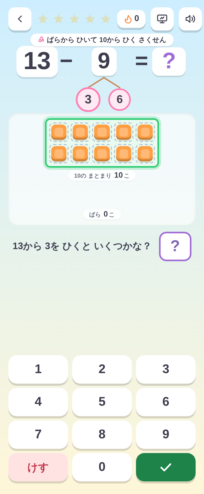

きれいな 10の まとまりから ひいて いきます。

### ミックスで どちらも れんしゅうする

3つめの「ミックス」を えらぶと、1もんごとに どちらかの さくせんが 出ます。

どちらの さくせんで といて いるかは、しきの 上の おびを 見れば わかります。「10から ひいて たす さくせん」か「ばらから ひいて 10から ひく さくせん」と <ruby>書<rt>か</rt></ruby>いて あります。

## まちがえた ときと、5もん おわった とき

まちがえても だいじょうぶです。とちゅうで とまって しまわないように なって います。

### まちがえた ときに 出る もの

まちがえた <ruby>回数<rt>かいすう</rt></ruby>に よって、出る ものが かわります。

1<ruby>回<rt>かい</rt></ruby>めは「おしい！もういちど！」と 出ます。もう 1<ruby>回<rt>かい</rt></ruby> かんがえて こたえて ください。

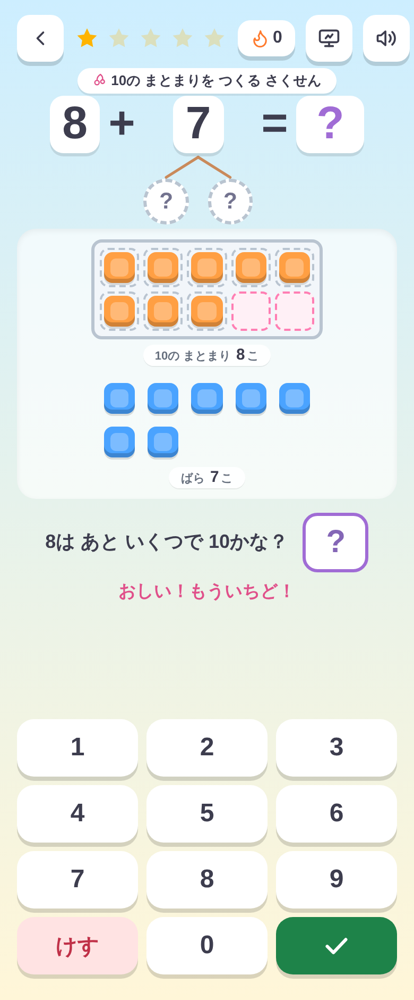

こたえの ところが ふるえて、赤い ことばが 出ます。

2<ruby>回<rt>かい</rt></ruby>めは ヒントが 出ます。<ruby>何<rt>なに</rt></ruby>を すれば よいかが <ruby>書<rt>か</rt></ruby>いて あります。

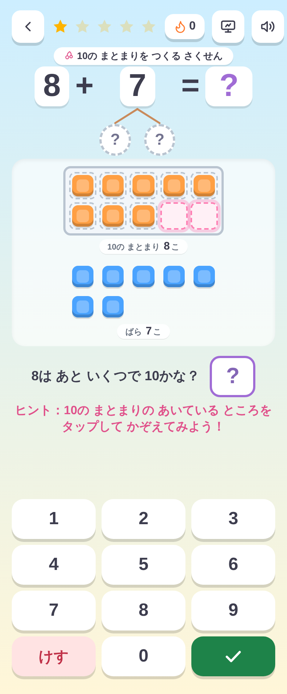

<ruby>何<rt>なに</rt></ruby>を すれば よいかが ピンクの 字で 出ます。

3<ruby>回<rt>かい</rt></ruby>めは こたえを 見せて、そのまま つぎへ すすみます。

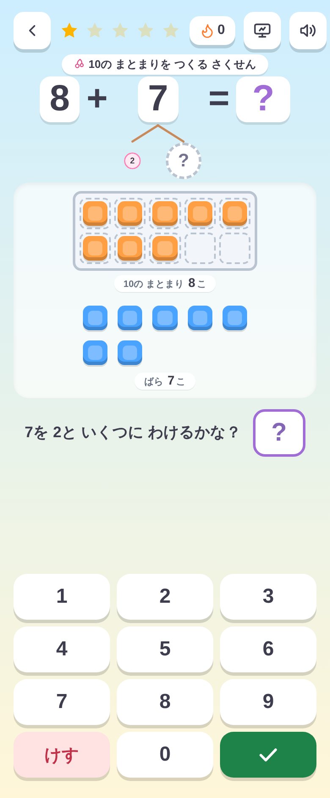

「こたえは 2 だよ。いっしょに すすもう！」と 出ます。

【！】<ruby>覚<rt>おぼ</rt></ruby>えておいて ほしいこと:

- こたえを 見て すすんだ もんだいは、「じぶんで とけた」には かぞえません。マップの <ruby>色<rt>いろ</rt></ruby>も「にがて」に もどります。
- タイムアタックでは、ヒントも こたえも 出ません。まちがえた <ruby>数<rt>かず</rt></ruby>だけが かぞえられます。

### せいかいの あとに 出る「けいさんの しかた」

せいかいすると、その しきの「けいさんの しかた」が 4<ruby>行<rt>ぎょう</rt></ruby> 出ます。

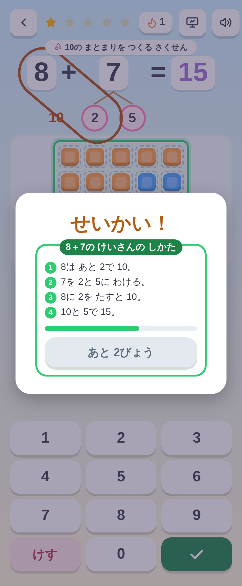

5びょう たつまで、この まどは 出た ままです。

- 「あと ◯びょう」の あいだは つぎへ すすめません。<ruby>声<rt>こえ</rt></ruby>に 出して <ruby>読<rt>よ</rt></ruby>んで みて ください。
- 5びょう たつと ボタンが「つぎへ」に かわります。おすと つぎの もんだいです。

### 5もん おわった とき

5もん とくと、おいわいの <ruby>画面<rt>がめん</rt></ruby>が 出ます。

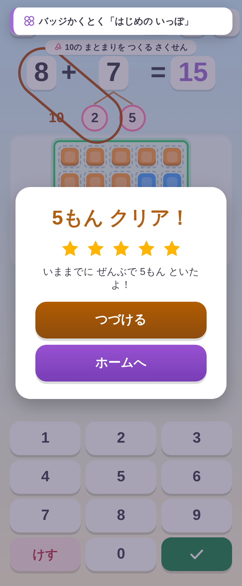

いままでに ぜんぶで なんもん といたかも 出ます。

- 「つづける」… つぎの 5もんを はじめます
- 「ホームへ」… ホームの <ruby>画面<rt>がめん</rt></ruby>に もどります

### とちゅうで やめる

<ruby>画面<rt>がめん</rt></ruby>の 左上の「＜」を おすと、とちゅうで やめられます。

やめた ところまでは「あしあと」に「とちゅうまで」と して のこります。5もん とけて いなくても、といた ぶんの きろくは きえません。

【！】<ruby>覚<rt>おぼ</rt></ruby>えておいて ほしいこと:

- 「じぶんで しきを いれる」で やめた ときだけ、しきを 入れる <ruby>画面<rt>がめん</rt></ruby>に もどります。ほかは ホームに もどります。
- タブを とじたり ほかの <ruby>画面<rt>がめん</rt></ruby>に うつったり しても、5ふん いじょう もどって こなければ おなじように「とちゅうまで」に なります。
- もどって くると、のこりの <ruby>数<rt>かず</rt></ruby>で あたらしく はじまります。

## タイムアタックで はやさに ちょうせんする

10もんを あんざんで とく モードです。ブロックも 手じゅんも 出ません。こたえだけを 入れます。

### タイムアタックを はじめる

1. ホームの「タイムアタック」を おして ください。
2. おした しゅんかんから <ruby>時間<rt>じかん</rt></ruby>が はじまります。

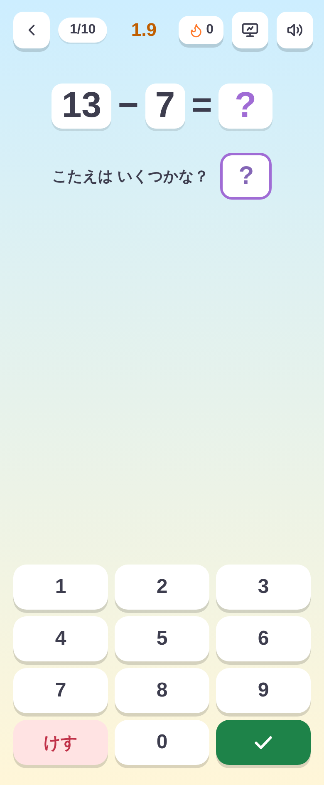

左上に「1/10」と いまの タイムが 出ます。

3. 「こたえは いくつかな？」に、キーパッドで こたえて ください。
4. 10もん おわると けっかが 出ます。

### <ruby>星<rt>ほし</rt></ruby>の とりかたと さいこうきろく

おわると <ruby>星<rt>ほし</rt></ruby>の <ruby>数<rt>かず</rt></ruby>と タイムが 出ます。

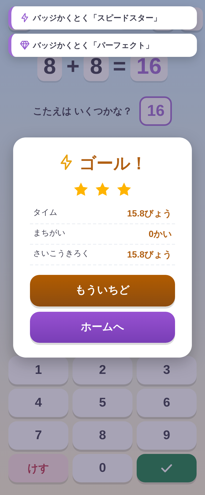

タイム・まちがい・さいこうきろくの 3つが ならびます。

<ruby>星<rt>ほし</rt></ruby>の <ruby>数<rt>かず</rt></ruby>は、つぎの ように きまります。

- <ruby>星<rt>ほし</rt></ruby> 3つ … まちがい 0<ruby>回<rt>かい</rt></ruby>で、60びょう いない
- <ruby>星<rt>ほし</rt></ruby> 2つ … まちがい 2<ruby>回<rt>かい</rt></ruby>まで、90びょう いない
- <ruby>星<rt>ほし</rt></ruby> 1つ … それ いがい

【！】<ruby>覚<rt>おぼ</rt></ruby>えておいて ほしいこと:

- 「さいこうきろく」は、いちばん はやかった タイムです。ずっと のこります。
- 「もういちど」で すぐに もう 1<ruby>回<rt>かい</rt></ruby> できます。
- はじめて クリアすると「スピードスター」、まちがい 0<ruby>回<rt>かい</rt></ruby>で クリアすると「パーフェクト」の バッジが もらえます。

## はってんもんだいで 2けたの けいさんに ちょうせんする

2けた ± 1けたの けいさんです。おおきな <ruby>数<rt>かず</rt></ruby>でも「10の まとまり」の かんがえかたが そのまま つかえる ことが わかります。

### はってんを はじめて、しゅるいを えらぶ

1. ホームの「はってん」を おして ください。
2. 「はってんもんだい」の <ruby>画面<rt>がめん</rt></ruby>が 出ます。

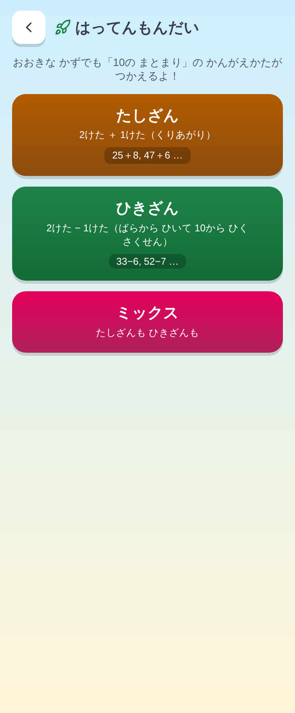

たしざん・ひきざん・ミックスの 3つから えらべます。

3. 1つ おすと すぐに 1もんめが 出ます。ここも 5もんで 1セットです。

### 2けた＋1けた（10の ぼうに なる）

10が 10こ そろうと、ブロックが「10の ぼう」に がったいします。

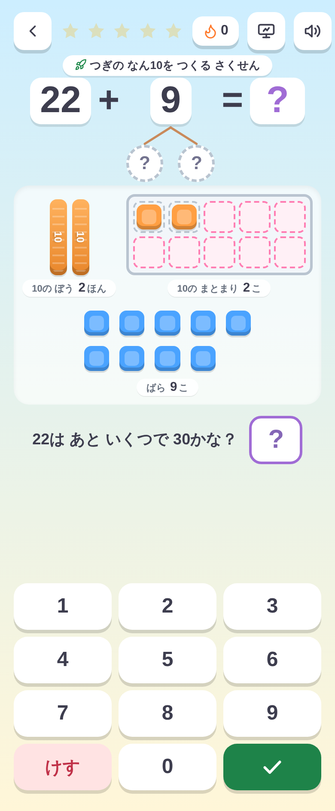

左の ほそながい ものが「10の ぼう」です。

たとえば 22＋9 なら、つぎの ように すすみます。

1. 22は あと いくつで 30かな？ … 8 と こたえます。
2. 9を 8と いくつに わけるかな？ … 1 と こたえます。
3. わけた 8こを タップして 10の まとまりに いれよう！ … 8こ うごかすと まとまりが ぼうに なります。「22に 8を たすと いくつかな？」に 30 と こたえます。
4. 30と 1で いくつかな？ … 31 と こたえます。

### 2けた−1けた（10の ぼうを ばらす）

ひきざんでは、ばらが たりなく なると 10の ぼうが 1ぽん ばらけて、10の まとまりに もどります。

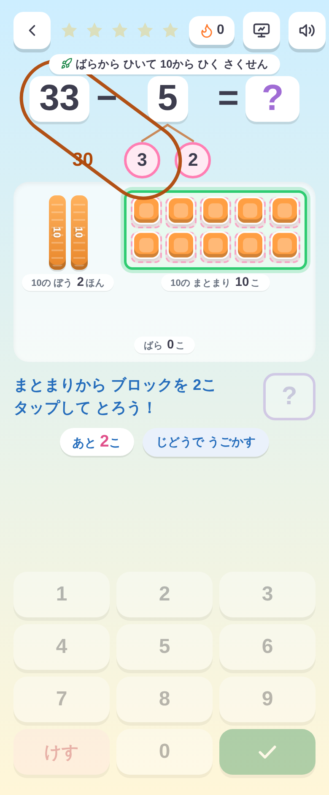

「10のぼうを 1ぽん ばらして まとまりに もどすよ！」の あとです。

たとえば 33−5 なら、つぎの ように すすみます。

1. ばらの 3から 5は ひけないね。さきに ばらの 3を ひくよ。5を 3と いくつに わけるかな？ … 2 と こたえます。
2. ばらの ブロックを 3こ ぜんぶ タップして とろう！ … 3こ とると「33から 3を ひくと いくつかな？」と きかれるので、30 と こたえます。
3. まとまりから ブロックを 2こ タップして とろう！ … 2こ とります。
4. 30から 2を ひくと いくつかな？ … 28 と こたえます。

【！】<ruby>覚<rt>おぼ</rt></ruby>えておいて ほしいこと:

- 一のくらいの けいさんは ふつうの けいさんカードと おなじです。はってんで といた ぶんも「マップ」の <ruby>色<rt>いろ</rt></ruby>に なります。
- はってんの もんだいは XP が おおめです。1<ruby>回<rt>かい</rt></ruby>めで せいかいすると 15 XP もらえます。

## じぶんで しきを いれて いっしょに かんがえる

きょうかしょや プリントに 出て きた しきを 入れると、ブロックで いっしょに かんがえて くれます。

### しきを 入れて はじめる

1. ホームの「じぶんで しきを いれる」を おして ください。

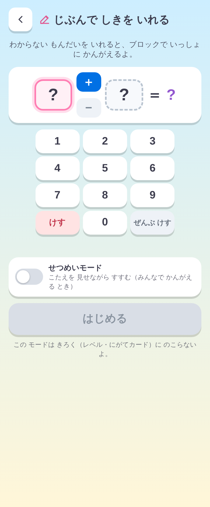

上が しきの ところ、下が キーパッドです。

2. キーパッドで まえの <ruby>数<rt>かず</rt></ruby>を 入れて ください。
3. 「＋」か「−」を おして ください。
4. うしろの <ruby>数<rt>かず</rt></ruby>を 入れて ください。
5. 「はじめる」を おすと、れんしゅうの <ruby>画面<rt>がめん</rt></ruby>に かわります。

「けす」で 1文字ずつ、「ぜんぶ けす」で しき ぜんぶを けせます。しきの すうじを おすと、なおしたい ほうへ うつれます。

### 入れられない しきの ときに 出る ことば

入れられる しきには きまりが あります。

- まえの <ruby>数<rt>かず</rt></ruby>も うしろの <ruby>数<rt>かず</rt></ruby>も 99まで
- たしざんは こたえも 99まで
- ひきざんは、まえの <ruby>数<rt>かず</rt></ruby>が うしろの <ruby>数<rt>かず</rt></ruby>いじょう（こたえが 0 いじょうに なる こと）

きまりから <ruby>外<rt>はず</rt></ruby>れると「はじめる」が おせなく なり、そのわけが すぐ 下に 出ます。

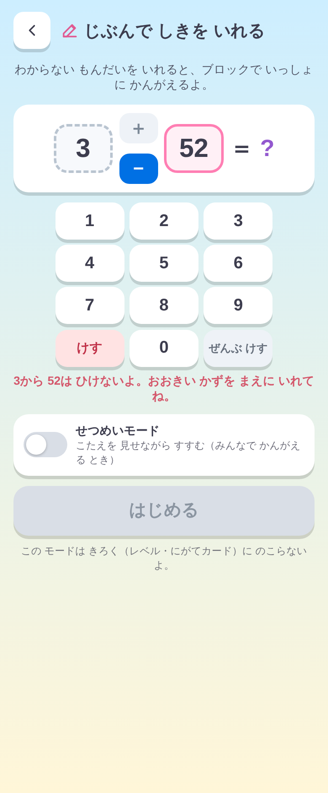

「3から 52は ひけないよ。」と 出ました。

### さくせんを えらぶ・せつめいモードを つかう

11−2 から 18−9 までの ひきざんを 入れた ときは、2つの さくせんから えらべます。

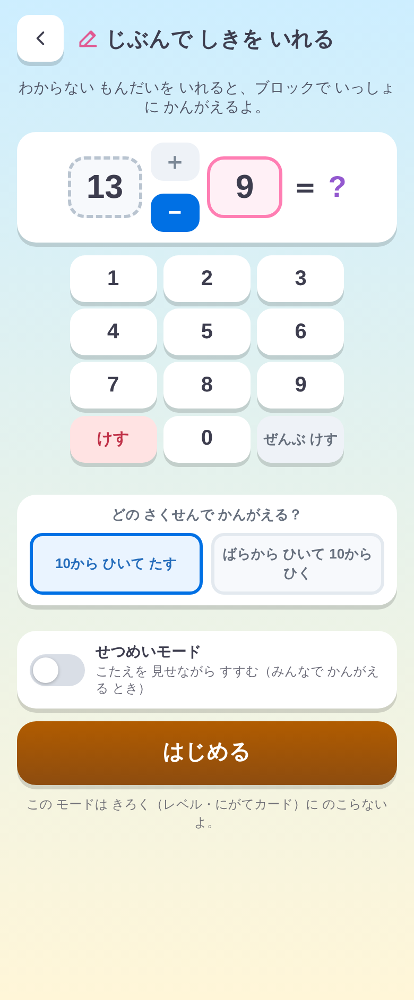

青い わくが ついて いる ほうが、いま えらばれて います。

その下の「せつめいモード」を 入に すると、こたえを 見せながら 手じゅんを たどれます。みんなで かんがえる ときに つかいます。

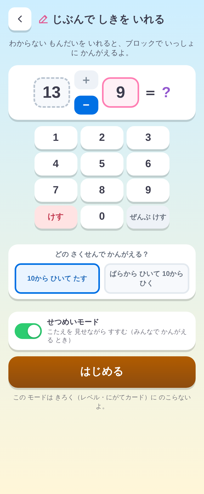

スイッチが 右に うごくと 入です。

せつめいモードを 入に して「はじめる」を おすと、キーパッドの かわりに「こたえを 見る」の ボタンが 出ます。

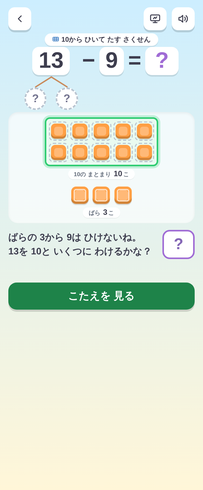

下に「こたえを 見る」の ボタンが 出ます。

1. 「こたえを 見る」を おすと、こたえと よみあげる 文が 出ます。
2. ボタンが「つぎへ」に かわるので、おすと つぎの 手じゅんへ すすみます。
3. ブロックを うごかす ところだけは、せつめいモードでも 手で タップします。

### とけた あとに えらぶ

とけると、3つの ボタンが 出ます。

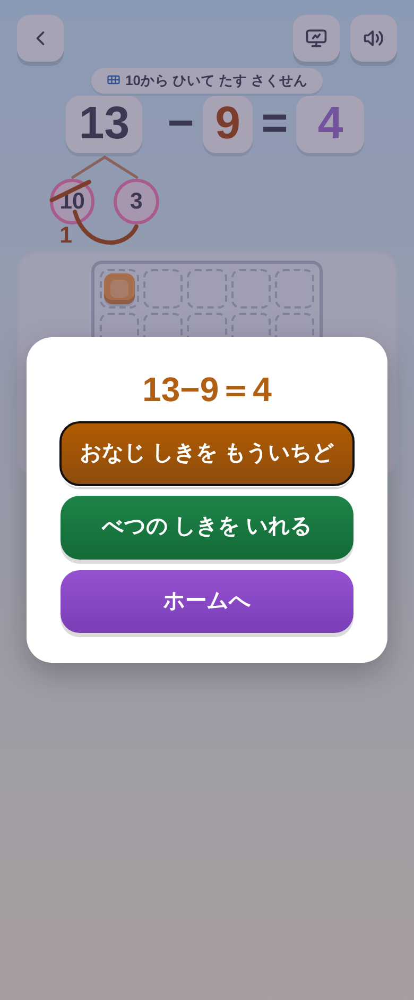

しきと こたえが 大きく 出ます。

- 「おなじ しきを もういちど」… おなじ しきを もう 1<ruby>回<rt>かい</rt></ruby>
- 「べつの しきを いれる」… しきを 入れる <ruby>画面<rt>がめん</rt></ruby>に もどる
- 「ホームへ」… ホームの <ruby>画面<rt>がめん</rt></ruby>に もどる

【！】<ruby>覚<rt>おぼ</rt></ruby>えておいて ほしいこと:

- この モードで といた ぶんは、きろくに のこりません。レベルも XP も マップも カレンダーも バッジも あしあとも うごきません。
- せつめいモードを 入に した ことは のこります。つぎに ひらいた ときも 入の ままです。

## せいせきと あしあとで、といた <ruby>数<rt>かず</rt></ruby>を 見る

ホームの「きろく」を おすと、これまでの がんばりが 見られます。上の タブで 5つに <ruby>分<rt>わ</rt></ruby>かれて います。

### きろくの <ruby>画面<rt>がめん</rt></ruby>を ひらく

1. ホームの「きろく」を おして ください。
2. 「がんばりの きろく」の <ruby>画面<rt>がめん</rt></ruby>が 出ます。
3. 上の タブ（せいせき・あしあと・マップ・カレンダー・バッジ）を おすと きりかわります。
4. 左上の「＜」で ホームへ もどれます。

### せいせき（ボタンごとの といた <ruby>数<rt>かず</rt></ruby>）

さいしょに 出る タブです。えらんだ ボタンごとに、といた <ruby>数<rt>かず</rt></ruby>と れんぞく せいかいの さいこうきろくが ならびます。

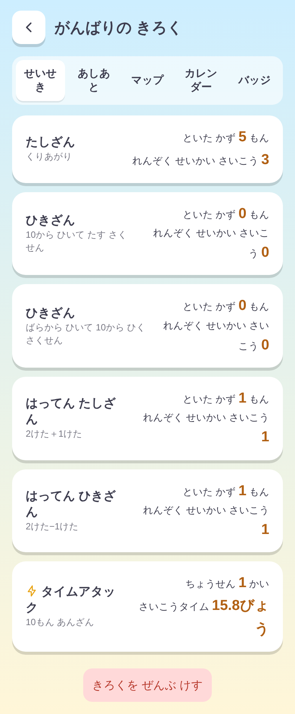

いちばん下は タイムアタックの きろくです。

ならぶのは たしざん・ひきざん（2つの さくせんは べつべつ）・はってんの たしざん・はってんの ひきざん・タイムアタックの 6つです。

### あしあと（この 1しゅうかんの ようす）

2つめの タブです。この 1しゅうかんに とりくんだ <ruby>回数<rt>かいすう</rt></ruby>・といた もんだいの <ruby>数<rt>かず</rt></ruby>・いっぱつせいかいの わりあい・がくしゅうした <ruby>時間<rt>じかん</rt></ruby>が 出ます。

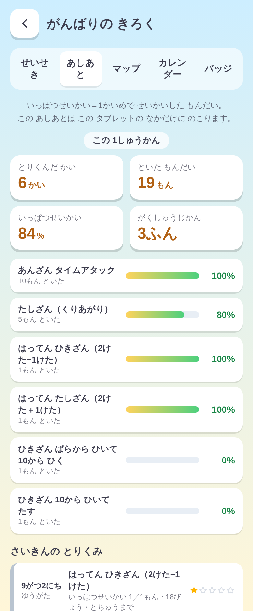

上の 4つの ますが、この 1しゅうかんの まとめです。

「いっぱつせいかい」は、1<ruby>回<rt>かい</rt></ruby>めで せいかいした もんだいの ことです。その下に、さいきんの とりくみが 12<ruby>回<rt>かい</rt></ruby>ぶんまで ならびます。

【！】<ruby>覚<rt>おぼ</rt></ruby>えておいて ほしいこと:

- とりくんだ 日づけは 出ますが、<ruby>時間<rt>じかん</rt></ruby>は「ごぜん」「ごご」「ゆうがた」までしか 出ません。
- 「とちゅうまで」と ついて いる ものは、5もん とききらずに やめた ぶんです。
- 1しゅうかん いじょう あいて いる ときは、「この 1しゅうかん」の かわりに「これまで」と 出ます。
- あしあとは、ほかの GIGA スクールの アプリと <ruby>共通<rt>きょうつう</rt></ruby>の きろくです。「きろくを ぜんぶ けす」を おしても きえません。

## マップ・カレンダー・バッジで のびを 見る

のこりの 3つの タブでは、けいさんカード 1まいずつの ようすと、れんしゅうした 日と、あつめた バッジが 見られます。

### マップ（けいさんカード 1まいずつの ようす）

たしざん 26ます、ひきざん 36ますの ひょうです。1ますが けいさんカード 1まいです。

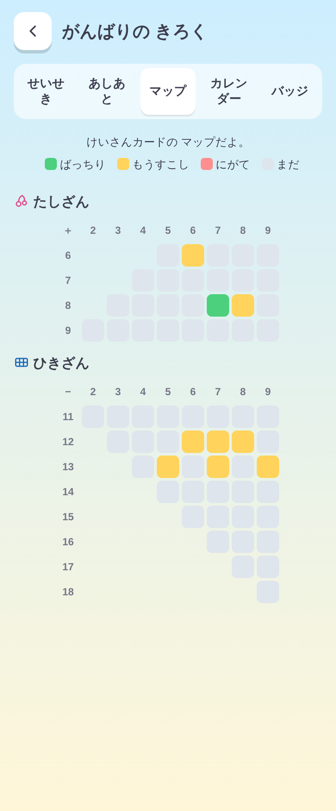

上が たしざん、下が ひきざんの マップです。

<ruby>色<rt>いろ</rt></ruby>の いみは つぎの とおりです。

- みどり（ばっちり）… 3<ruby>回<rt>かい</rt></ruby> れんぞくで せいかいした
- きいろ（もうすこし）… 1<ruby>回<rt>かい</rt></ruby>か 2<ruby>回<rt>かい</rt></ruby> れんぞくで せいかいして いる
- あか（にがて）… さいごに まちがえた
- はいいろ（まだ）… まだ 1<ruby>回<rt>かい</rt></ruby>も といて いない

### カレンダー（れんしゅうした 日）

れんしゅうした 日に しるしが つきます。

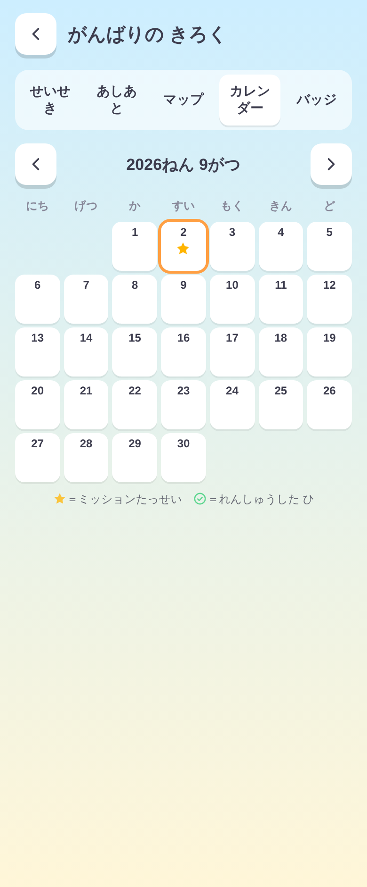

左右の やじるしで、まえの 月・つぎの 月に うつれます。

- <ruby>星<rt>ほし</rt></ruby>の しるし … きょうの ミッション（1にち 10もん）を たっせいした 日
- まるの しるし … れんしゅうした 日

### バッジ（10しゅるい）

あつめられる バッジは 10しゅるいです。

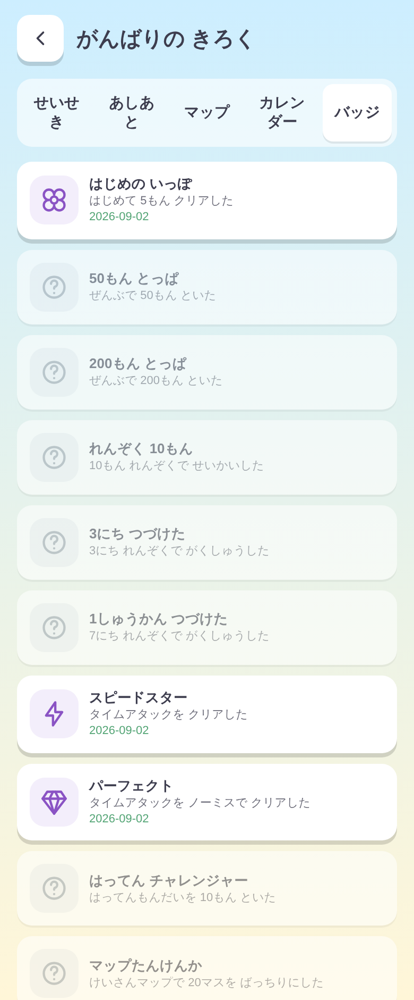

まだ もらって いない バッジは「？」の <ruby>絵<rt>え</rt></ruby>です。

- はじめの いっぽ … はじめて 5もん クリアした
- 50もん とっぱ … ぜんぶで 50もん といた
- 200もん とっぱ … ぜんぶで 200もん といた
- れんぞく 10もん … 10もん れんぞくで せいかいした
- 3にち つづけた … 3にち れんぞくで がくしゅうした
- 1しゅうかん つづけた … 7にち れんぞくで がくしゅうした
- スピードスター … タイムアタックを クリアした
- パーフェクト … タイムアタックを まちがい なしで クリアした
- はってん チャレンジャー … はってんもんだいを 10もん といた
- マップたんけんか … マップで 20ますを ばっちりに した

## 【！！】きろくの のこりかたと、けしかた

きろくが どこに あるのかと、けすと どう なるのかを <ruby>書<rt>か</rt></ruby>いて あります。けす ボタンは もとに もどせないので、おす まえに <ruby>読<rt>よ</rt></ruby>んで ください。

### きろくが どこに のこるか

きろくは、その タブレットの ブラウザの 中だけに のこります。インターネットの むこうがわには <ruby>送<rt>おく</rt></ruby>りません。

そのため、つぎの ことが おきます。

- タブレットを かえると、きろくは ひきつがれません
- おなじ タブレットを べつの 人が つかうと、きろくが まざります
- ブラウザの「りれきを けす」で いっしょに きえる ことが あります
- iPad の Safari では、7日 まったく ひらかないと きえる ことが あります（ホーム<ruby>画面<rt>がめん</rt></ruby>に ついかして おくと きえにくく なります）

### きろくに のこらない もの

「じぶんで しきを いれる」で といた ぶんは、いっさい のこりません。レベル・XP・にがてカード・カレンダー・バッジ・あしあとの どれも うごきません。

### 【！！】きろくを ぜんぶ けす

「せいせき」の タブの いちばん下に、赤い ボタンが あります。

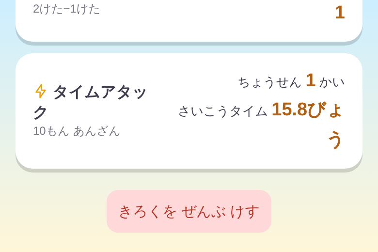

「きろくを ぜんぶ けす」の ボタンです。

1. 「きろく」を ひらいて「せいせき」の タブを えらび、いちばん下まで ながして ください。
2. 「きろくを ぜんぶ けす」を おして ください。
3. 「けしますか？」と きかれるので、「OK」を おすと きえます。

【！！】いちばん だいじな ちゅうい:

- けした きろくは もとに もどせません。インターネットの むこうがわに ひかえが ないので、だれにも もどせません。
- きえるのは レベル・にがてカード・カレンダー・バッジです。
- 「あしあと」は のこります。ほかの アプリと <ruby>共通<rt>きょうつう</rt></ruby>の きろくだからです。

## <ruby>電子黒板<rt>でんしこくばん</rt></ruby>に うつして みんなで つかう（先生むけ）

この <ruby>章<rt>しょう</rt></ruby>は、<ruby>教室<rt>きょうしつ</rt></ruby>で 一せいに つかう 先生むけです。ひとりで れんしゅうする ぶんには、<ruby>読<rt>よ</rt></ruby>まなくても だいじょうぶです。

### <ruby>画面<rt>がめん</rt></ruby>を 大きく して うつす

<ruby>画面<rt>がめん</rt></ruby>の 右上に ある モニターの <ruby>絵<rt>え</rt></ruby>の ボタン（「大きく<ruby>表示<rt>ひょうじ</rt></ruby>」）を <ruby>押<rt>お</rt></ruby>してください。

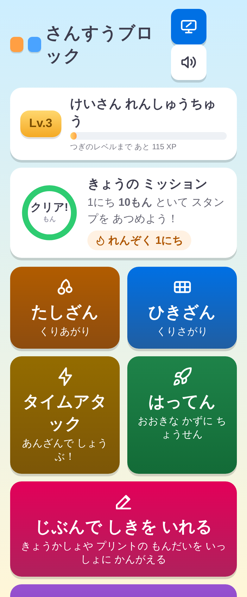

字も ボタンも まとめて 大きく なります。

- 字と ボタンが 大きくなり、<ruby>教室<rt>きょうしつ</rt></ruby>の うしろの せきからも <ruby>読<rt>よ</rt></ruby>めます
- <ruby>同時<rt>どうじ</rt></ruby>に <ruby>画面<rt>がめん</rt></ruby>いっぱい（フルスクリーン）に なります
- もう <ruby>一度<rt>いちど</rt></ruby> <ruby>押<rt>お</rt></ruby>すと、もとの 大きさに もどります
- ホームでも れんしゅうの <ruby>画面<rt>がめん</rt></ruby>でも、おなじ ボタンが 右上に あります

【！】<ruby>覚<rt>おぼ</rt></ruby>えておいて いただきたい こと:

- <ruby>押<rt>お</rt></ruby>した じょうたいは のこります。つぎに ひらいた ときも 大きい ままです。
- ブラウザが フルスクリーンを ことわった ときでも、大きさだけは 大きい ままに なります。
- Esc キーで フルスクリーンを ぬけても、大きさは そのままです。もどすには もう <ruby>一度<rt>いちど</rt></ruby> ボタンを <ruby>押<rt>お</rt></ruby>してください。

### せつめいモードで、みんなで かんがえる

<ruby>発問<rt>はつもん</rt></ruby>しながら すすめたい ときは、「じぶんで しきを いれる」の「せつめいモード」を つかってください。手じゅんは、この 上の「じぶんで しきを いれて いっしょに かんがえる」の <ruby>章<rt>しょう</rt></ruby>に あります。

この モードで といた ぶんは、レベルにも にがてカードにも のこりません。<ruby>授業<rt>じゅぎょう</rt></ruby>の おてほんに つかっても、きろくが あれる <ruby>心配<rt>しんぱい</rt></ruby>は ありません。

### キーボードで こたえる

<ruby>外<rt>そと</rt></ruby>づけキーボードや <ruby>電子黒板<rt>でんしこくばん</rt></ruby>から、タップしなくても すすめられます。

- しきを 入れる <ruby>画面<rt>がめん</rt></ruby> … すうじ・「+」・「-」・Backspace・Enter（Enter で はじまります）
- れんしゅうの <ruby>画面<rt>がめん</rt></ruby> … すうじ・Backspace・Enter（Enter で けってい）
- せつめいモード … Enter か スペース（「こたえを 見る」と「つぎへ」を かねます）

## うまく いかない ときは

よく ある ことと、その なおしかたを ならべます。上から じゅんに ためして みて ください。

### <ruby>画面<rt>がめん</rt></ruby>が 白いまま／ブロックが 出ない

いちど とじて、もう 1<ruby>回<rt>かい</rt></ruby> ひらいて ください。

それでも なおらない ときは、ブラウザを ぜんぶ とじてから ひらきなおして ください。

### 「あたらしい ばんが あります」と 下に 出た

あたらしい ばんが とどいた しらせです。<ruby>画面<rt>がめん</rt></ruby>の いちばん下に 出ます。

- 「さいしんに する」を おすと きりかわります
- おすまで きりかわりません。もんだいを といて いる とちゅうなら、その もんだいを おえてから おして ください
- おさずに とじても、つぎに ひらくと また 出ます

### インターネットが つながらない ときは

いちど ひらいた ことが あれば、つながって いなくても そのまま つかえます。

まだ 1<ruby>回<rt>かい</rt></ruby>も ひらいて いない タブレットでは、つぎの <ruby>画面<rt>がめん</rt></ruby>が 出ます。

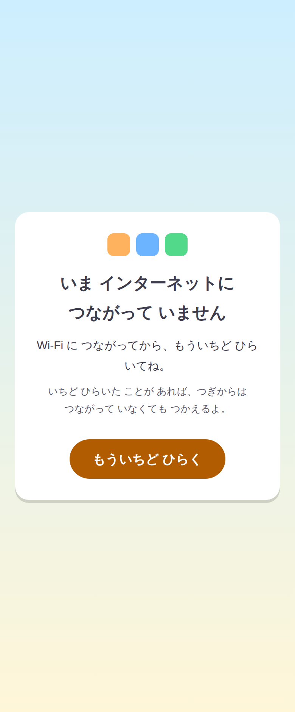

「もういちど ひらく」で やりなおせます。

### 字が 小さくて <ruby>読<rt>よ</rt></ruby>めない

2本の ゆびで <ruby>広<rt>ひろ</rt></ruby>げると（ピンチ）、大きく できます。

<ruby>教室<rt>きょうしつ</rt></ruby>で うつす ときは、右上の「大きく<ruby>表示<rt>ひょうじ</rt></ruby>」の ボタンの ほうが かくじつです。

### うごきが 気に なる 子が いる とき

タブレットの せっていで「<ruby>視差効果<rt>しさこうか</rt></ruby>を <ruby>減<rt>へ</rt></ruby>らす」か「アニメーションを <ruby>減<rt>へ</rt></ruby>らす」を 入に して ください。アプリが それを 見て、<ruby>紙<rt>かみ</rt></ruby>ふぶきなどの うごきを とめます。

### きろくが 空に なった とき

「きろくの のこりかたと、けしかた」の <ruby>章<rt>しょう</rt></ruby>を <ruby>読<rt>よ</rt></ruby>んで ください。

タブレットを かえた・りれきを けした・iPad で 7日 いじょう ひらかなかった、の どれかです。きろくは インターネットの むこうがわに ないので、もとに もどす ほうほうは ありません。

### それでも なおらない ときは

まず、この アプリを おしえて くれた 先生か、学校の じょうほうたんとうの 先生に そうだんして ください。いちばん 早く かいけつします。

それでも わからない ときは、この ページの いちばん下に ある <ruby>問<rt>と</rt></ruby>い<ruby>合<rt>あ</rt></ruby>わせ先から <ruby>知<rt>し</rt></ruby>らせて ください。
