# 教室で使えるかもしれないもの作り #◯ 「どうして そこで わけるの？」で止まらない。ブロックを自分で動かす計算アプリ「さんすうブロック」

## 🏫 はじめに

くりあがりのあるたし算。1年生が算数でつまずく、最初の大きな山ではないでしょうか。

8たす6なら、8はあと2で10。6を2と4にわける。8に2をたして10。10と4で14。教科書にはそう書いてあります。この手順をなぞれば答えは出ますし、テストの点にもなります。

ただ、ノートのさくらんぼだけが上手になっていく子が、クラスに何人かいませんか。どうしてそこで6を2と4にわけるのか。どうして10をつくると楽になるのか。そこがぼんやりしたまま、書き方だけを覚えてしまう。ひき算に入ったとたんに手が止まるのは、たいていその子だと思います。

算数ブロックを配れば、その子にも見えるようになります。けれど、配って、並べて、落ちたのを拾って、数をたしかめて、また集める。45分のうちのけっこうな時間が、そこに消えていきます。一人が並べ終わるころには、別の子はもう飽きている。そして先生の手は二本しかないので、横についていられる子の分しか、ブロックは働いてくれません。

そこで作ったのが「さんすうブロック」です。教科書の「けいさんの しかた」の4つの手順を、そのまま画面の上のブロックにやらせるアプリです。

https://keisan-block.giga-school.com/

ブラウザで開くだけで使えます。会員登録もログインも、名前を入れるところもありません。いちばん大事にしたのは、画面が勝手にきれいに動くのではなく、子どもたちが自分の指でブロックを動かすところです。そこを取り上げてしまうと、ただのアニメーションを見せる道具になってしまうと思ったからです。

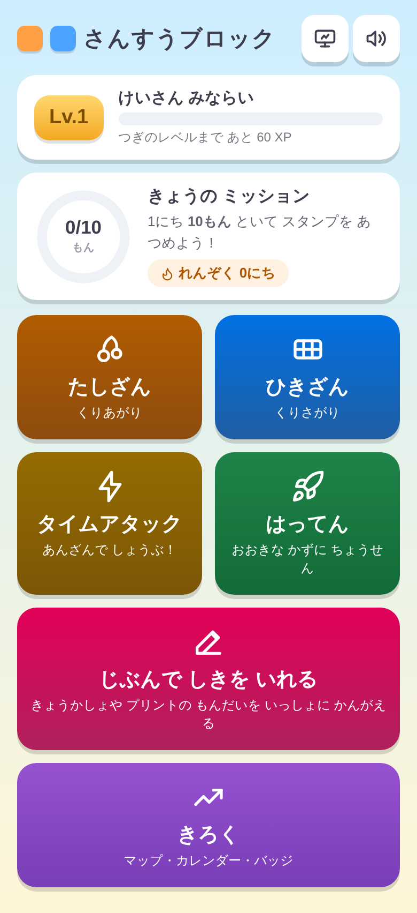

ホーム画面。レベルときょうのミッション、6つのメニューが一画面におさまっています。

## 📱 このアプリでできること

メニューは6つあります。

くりあがりのある「たしざん」と、くりさがりのある「ひきざん」。この2つがまん中です。10問を暗算で解く「タイムアタック」は、考え方が身についたあとの自動化をねらったものです。「はってん」は2けたと1けたの計算で、同じ10のまとまりの考え方をそのまま大きな数に使います。「じぶんで しきを いれる」は、教科書やプリントでつまずいた式をその場で打ちこめる、先生とおうちの方むけの入り口です。最後の「きろく」に、これまでの学習がぜんぶ集まります。

たしざんを選ぶと、いきなり問題が出ます。設定画面も、学年えらびもありません。

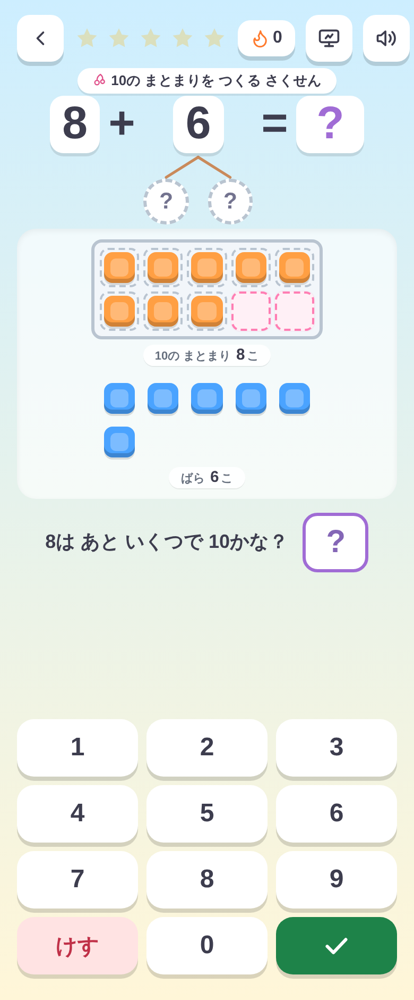

8たす6。上に出ている「10の まとまりを つくる さくせん」が、いま何を考えているかの目じるしです。

画面の上に式があり、その下に算数ブロックが並びます。オレンジが10のまとまり、青がばらです。最初の問いは「8は あと いくつで 10かな？」。10のまとまりの空いているところがピンクに光るので、指で数えて答えられます。

答えると、式の6の下にさくらんぼが出て、片方に2が入ります。次は「6を 2と いくつに わけるかな？」です。

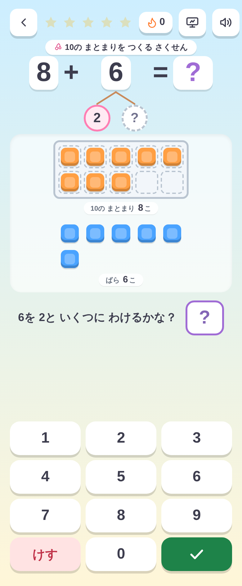

さくらんぼの左に2が入りました。残りをいくつに分けるかを、ここで答えます。

答えると、ばらのブロックも2と4の2かたまりに分かれます。ここまでは、よくある学習アプリと同じかもしれません。このアプリがふつうと違うのは、次のひと手間です。

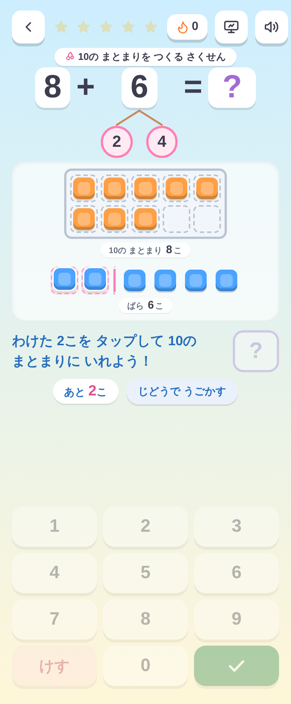

「わけた 2こを タップして 10の まとまりに いれよう！」。ばらが2と4に分かれています。ここではキーパッドが休んで、指で動かすまで先に進みません。

わけた分を10のまとまりに入れるのは、子どもたち自身です。ブロックをタップすると、そのブロックが空いているところへ飛んでいきます。全部入れ終わるとわくが緑に光り、そこではじめて「8に 2を たすと いくつかな？」と聞かれます。

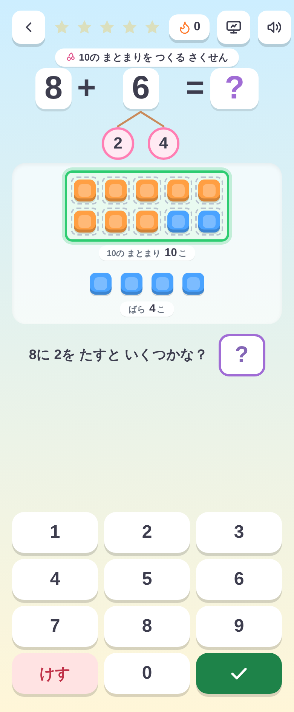

まとまりが10こになりました。この状態を目で見てから、10という数を答えます。

正解すると、式の上に「8と2」を囲む輪と、その横に10という書きこみが残ります。教科書で鉛筆を持って書きこむ印を、そのまま画面の上に再現しています。輪で囲む、使い終わった数にななめ線を引く、消した数の下に残りを小さく書く、あわせる2つの数をカーブでつなぐ。この4種類です。

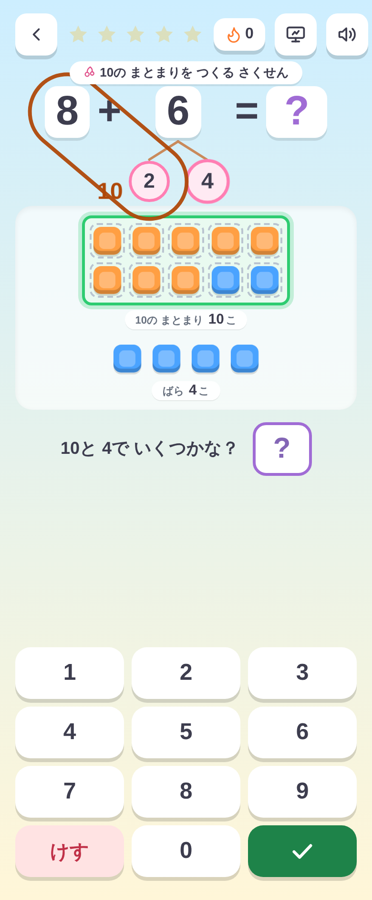

最後の問いは10と4。式に残った輪と10が、いま何をしたのかを見せてくれます。

そして正解すると、その問題の数で書き起こした「けいさんの しかた」の4行が出ます。

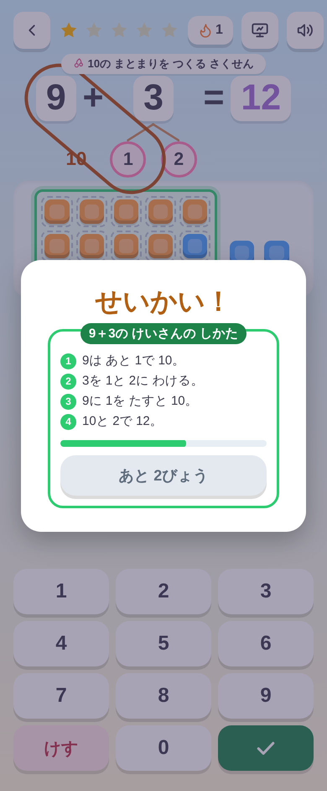

その問題の数のままで4行になります。読む時間を確保するため、5秒たつまで「つぎへ」は押せません。

ここは意識してじゃまをしています。押せてしまうと、子どもたちは読まずに次へ行くからです。5秒のあいだ、声に出して読んでもらえたらと思って入れました。

5問そろうと、星が5つ光ります。

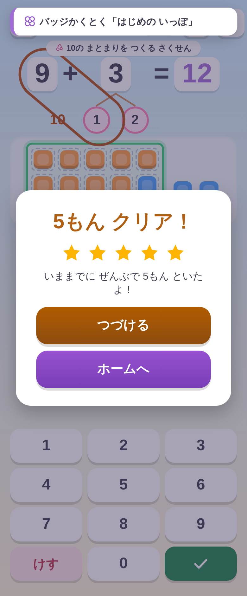

5問で一区切りです。1年生の集中がもつ長さを考えて、この長さにしました。

ひきざんには、教科書によって教える順がちがう2つの考え方があります。このアプリでは、減加法や減減法といった用語は出さず、やることがそのまま名前になった作戦名にしています。

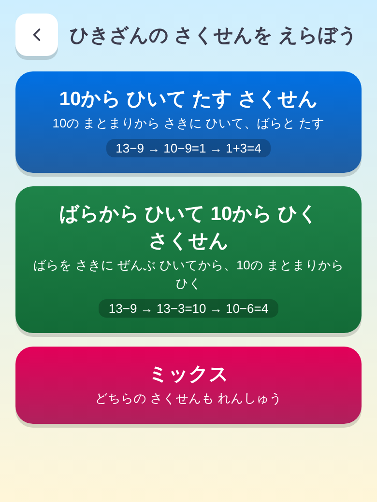

「10から ひいて たす さくせん」と「ばらから ひいて 10から ひく さくせん」。どちらも練習できます。

13ひく9で言えば、前のほうは10から9をひいて1、1と3で4。あとのほうは13から3をひいて10、10から6をひいて4です。お使いの教科書に合わせて選べますし、どちらが自分に合うかを子どもが選ぶ使い方もできると思います。ミックスを選ぶと両方が出ます。

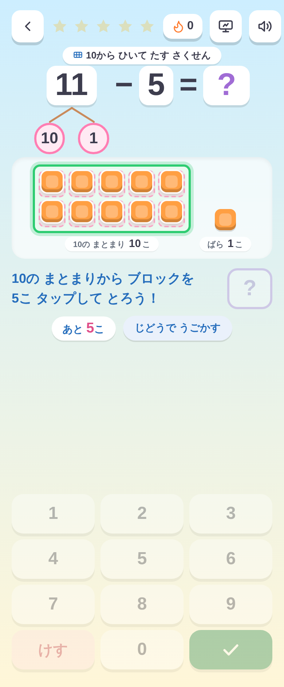

「10の まとまりから ブロックを 5こ タップして とろう！」。ひき算でも、取るのは自分の指です。

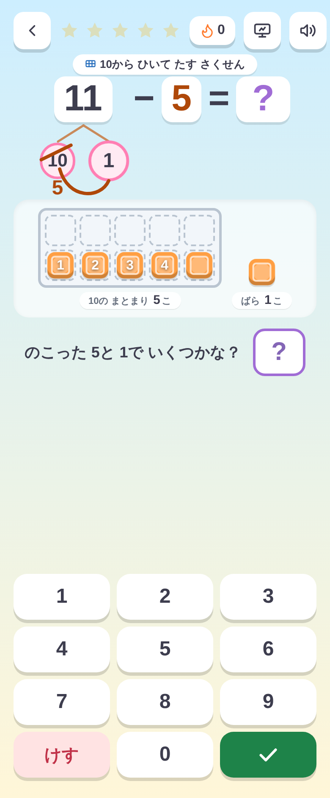

10から5をひいたので、10にななめ線が入り、その下に残りの5が小さく書きこまれます。ブロックには、数えたときの番号がついています。

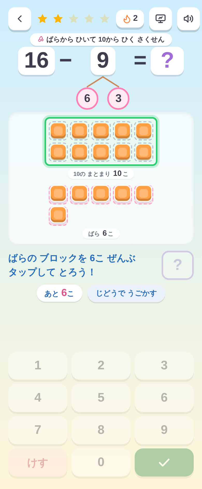

もう一つの作戦では、先にばらを全部はらいます。16ひく9なら、まずばらの6こを取って16を10にします。ばらがなくなってきれいな10のまとまりになる瞬間が、この作戦の見どころです。

考え方が身についてきたら「タイムアタック」です。10問を暗算で解いて、タイムとまちがい数で星がつきます。

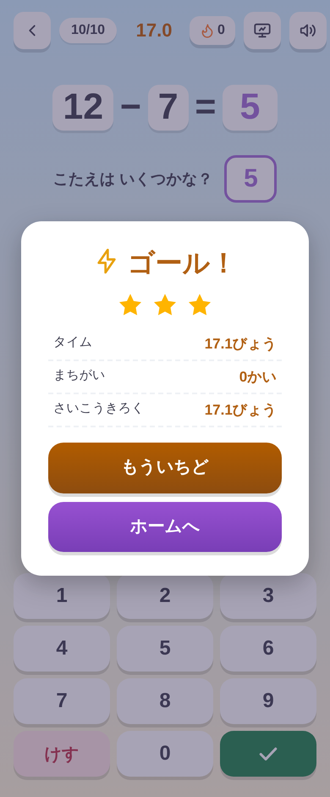

最高タイムが残るので、自分の記録との勝負になります。ここはステップの支えを外して、速く正確に出せる状態をねらっています。

## 🖐 ブロックを動かすのは、子どもたち自身です

このアプリでいちばん時間をかけたのが、この「自分で動かす」ところです。

答えを入力する前に、必ずブロックを操作するステップが入ります。10のまとまりに入れる。まとまりから取りのぞく。ばらを全部はらう。どれも一つずつタップしないと先に進みません。手を動かした結果が目の前に残るので、そのあと入れる数字が、ただの答えではなく自分がやったことの記録になります。

操作しているあいだは、残りが「あと ◯こ」と出ます。4秒さわらないでいると、次に押す1個が大きくゆれて教えてくれるようにしました。困っている子を、先生を呼ばずに一歩進ませたかったからです。それでも進めないときのために「じどうで うごかす」ボタンも置いてあります。まとめて動かしたいときや、一斉授業で時間を合わせたいときに使えます。

ブロックと空きマスは、タップすると1、2、3と数字がついて数えられます。押しなおすと数えなおしになります。さきほどの画面でブロックに番号がついていたのは、この機能です。

数える活動を画面の中に残したかったのは、1年生の算数がまだ「数える」の上に立っていると思うからです。頭のなかだけで処理させると、できているように見えて、あとで崩れることがある気がしています。

まちがえたときの扱いも、途中で止まらないようにしました。1回目は「もういちど！」とだけ言います。2回目でヒントが出ます。3回目で答えを見せて、いっしょに次へ進みます。

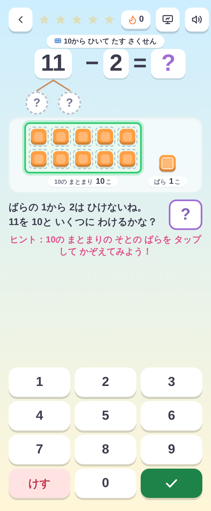

2回目のまちがいで、その問題に合わせたヒントが出ます。3回まちがえても止まりません。

3回で答えを見せるのは、そこで止まると1年生は画面を閉じてしまうからです。ただし、答えを見て進んだ問題は「自分で解けた」とは数えていません。あとで出てくる記録では、1回目で正解した問題だけを正答率に使っています。できたことにしてしまうと、記録が先生の役に立たなくなります。

「はってん」では、同じ考え方を2けたの計算に伸ばします。

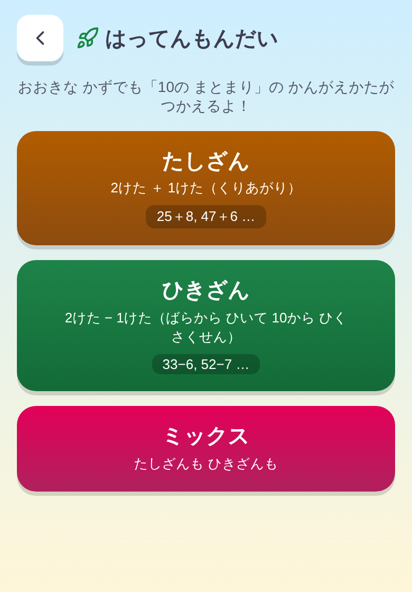

2けたと1けたのたし算とひき算。25たす8、33ひく6のような問題です。

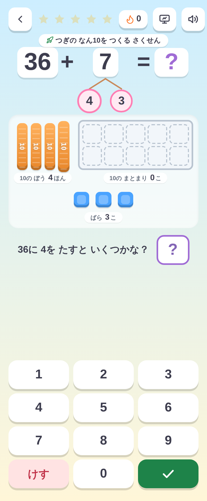

十のくらいは「10のぼう」で表します。まとまりが10こそろうと、1本のぼうに合体します。

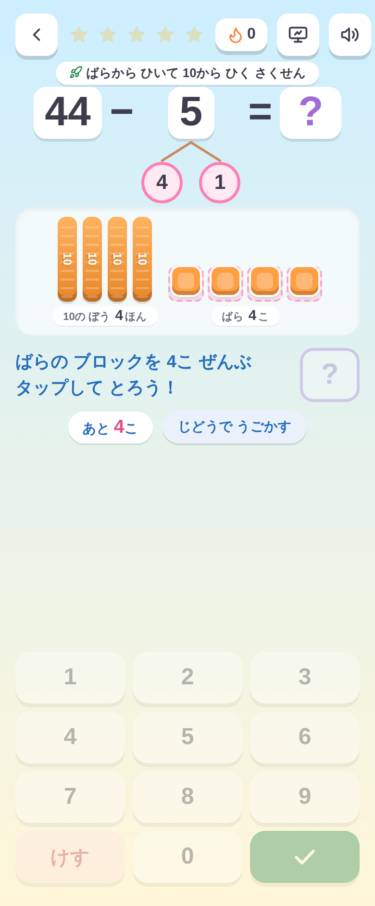

44ひく5。まずばらを全部はらってから、10のぼうを1本ばらしてまとまりに戻します。

位取りの理解につながればと思って入れた表現です。くりあがりを一度きりのできごとにせず、大きな数でも同じ作戦が使えることを、同じ見た目のまま見せられるようにしました。

## 💬 黒板の前で使う「せつめいモード」

先生に使ってほしいのが「じぶんで しきを いれる」です。

教科書やプリントで手が止まった式を、その場で打ちこめます。2けたと2けたまで、99までの数なら入ります。

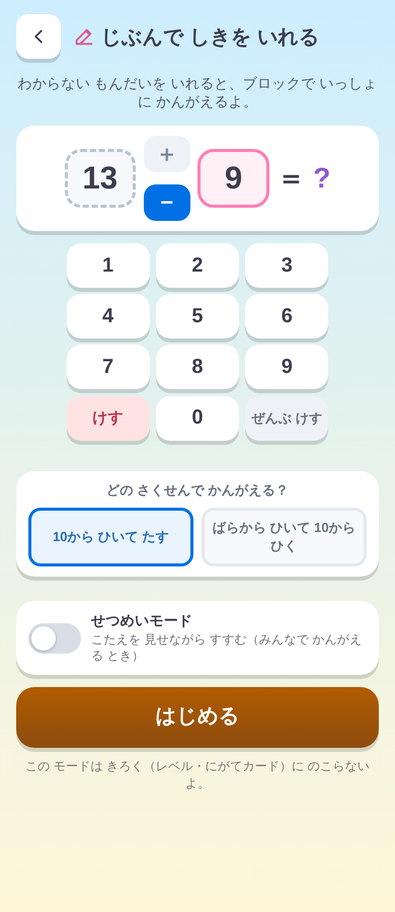

13ひく9のように2通りの考え方がある式では、どちらの作戦で考えるかを選べます。

打ちこんだ式が8たす6や13ひく9のように既習の作戦がそのまま使える形なら、いつものさくらんぼの4ステップで進みます。42ひく17のようにそこから外れる式は、10のまとまりで考える手順に自動で組み直します。17を10と7にわける。42から10をひいて32。7を2と5にわける。32から2をひいて30。30から5をひいて25。この5段階です。

そして、この画面には「せつめいモード」という切り替えがあります。入にすると、答えの入力を求めなくなります。

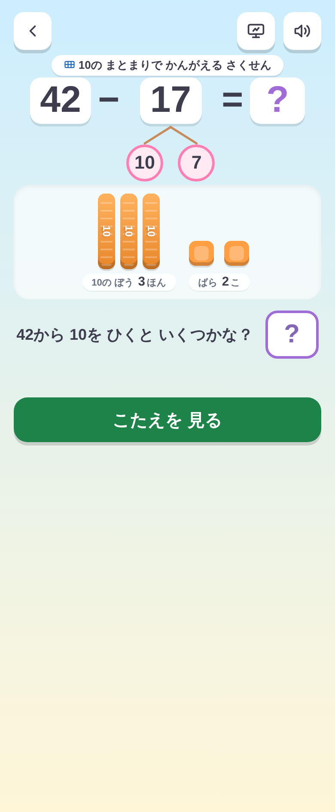

答えを入れるかわりに「こたえを 見る」が出ます。先生が問いかけて、みんなで考えて、それから押すための作りです。

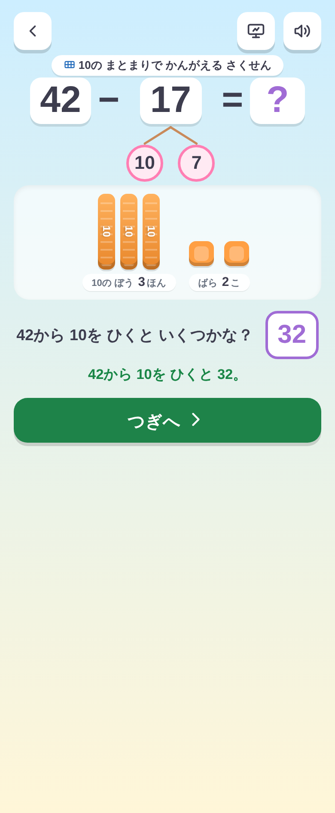

押すと答えが入り、その手順の言い方が下に出ます。もう一度押すと次へ進みます。

黒板の前で、先生のペースで進められるようにしたかったので、この形にしました。子どもに答えさせる場面では入力を使い、みんなで考える場面ではせつめいモードに切り替える、という使い分けができます。

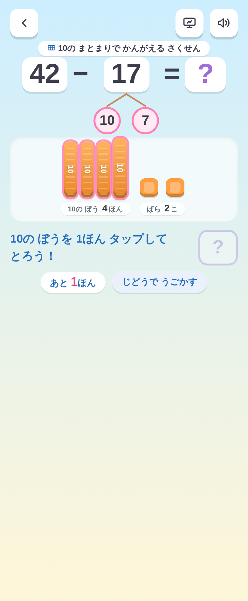

10のぼうも、ばらのブロックと同じようにタップして動かせます。

この「じぶんで しきを いれる」は、記録に残りません。レベルもXPも、にがてカードも、カレンダーも一切動きません。先生がデモで解いた分が子どもの記録に混ざると、あとで記録を見たときに何が起きたのか分からなくなるからです。

電子黒板に映すときは、画面の右上にあるモニターの絵のボタンを押してください。

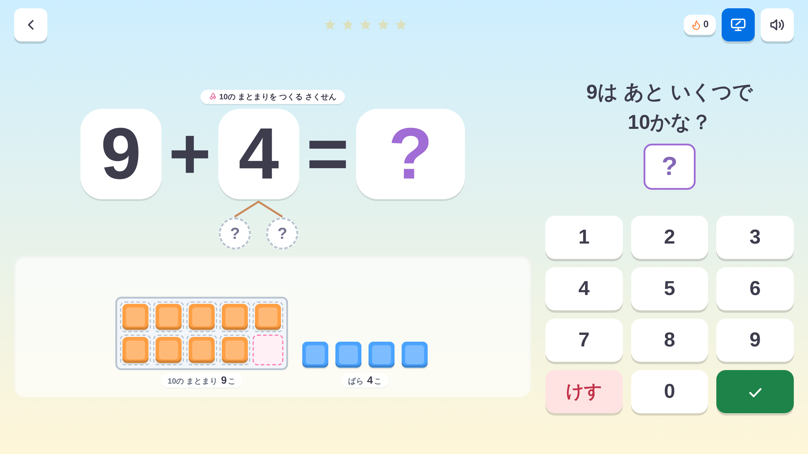

文字が150パーセントになり、ボタンの高さも64ピクセル以上に広がって、同時に画面いっぱいになります。教室のうしろの席からも読める大きさをねらいました。

押した状態は次に開いたときも残ります。共用端末を電子黒板専用にしているなら、一度押しておけば毎回押す必要はありません。

## ✨ 導入のメリット

三つのいいことが期待できます。

一つ目は、算数ブロックの準備と片づけがなくなることです。配る、数える、落ちたのを拾う、集める。この時間がまるごと消えます。しかも一人1台の端末があれば、クラス全員が同時に自分のブロックを持てます。先生が横についていられない子の手元にも、ブロックがある状態を作れます。

二つ目は、つまずいている子を、先生が呼ばれる前に見つけられることです。「きろく」の中にある「けいさんマップ」は、計算カード1枚1枚の習熟度を色で見せます。62枚のカードのうち、どこが黄色や赤のままなのかが一目で分かります。

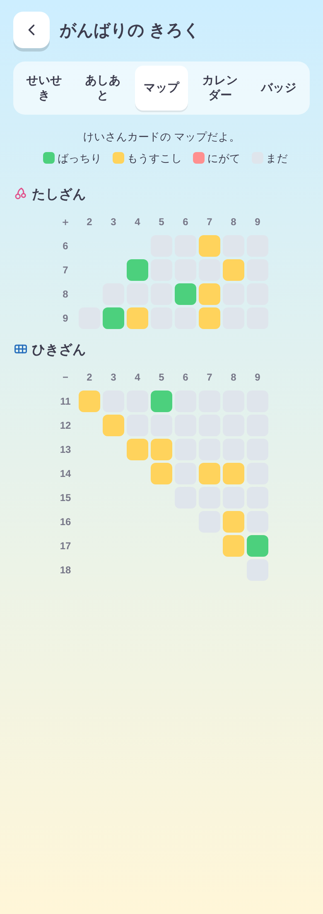

たし算26枚、ひき算36枚。3回続けて正解すると緑の「ばっちり」になります。

三つ目は、子どもが自分の伸びを自分で見られることです。「あしあと」というタブに、この1週間の取り組みが返ってきます。

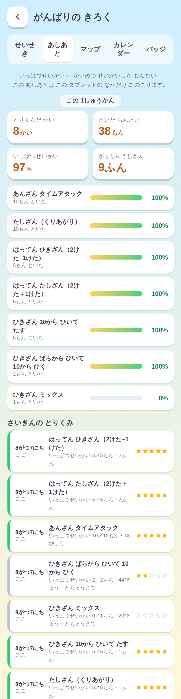

取り組んだ回数、といた問題数、1回目で正解した割合、学習時間。その下に、モードごとの正答率と最近の取り組みが並びます。子ども本人に返す画面です。

この画面では、時刻をごぜん、ごご、ゆうがたまでに丸めて表示しています。何時に勉強したかが細かく残ると、そこから家庭の様子が読めてしまうからです。学習の記録として必要な粒度は、そこまでで足りると考えました。

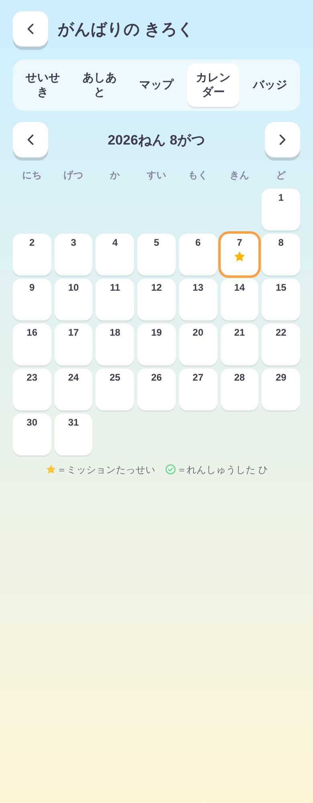

学習した日にスタンプがつきます。1日10問のミッションを達成した日は星になります。

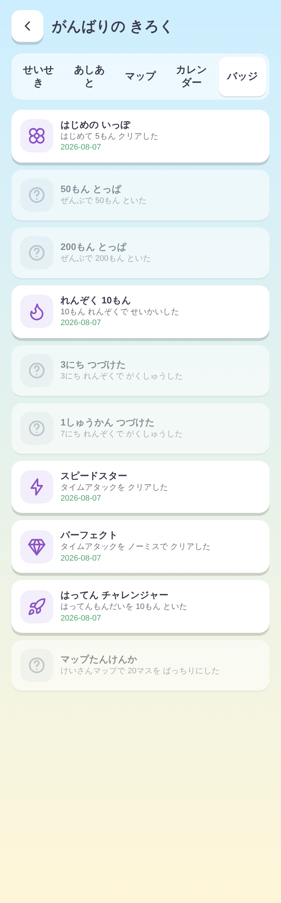

バッジは10種類。はじめて5問クリアした、10問続けて正解した、タイムアタックをノーミスでクリアした、といった内容です。

丸付けに追われている時間が減れば、そのぶん子どもの顔を見ていられます。ここがいちばん効いてほしいところです。

## 🛠️ 【管理者向け】導入手順

情報担当の先生に聞かれそうなことを、先にまとめておきます。

校内のフィルタリングで許可が必要なアドレスは、keisan-block.giga-school.com の1つだけです。

このアプリは、起動したあと外と通信しません。広告も、アクセス解析も、外から読みこむプログラムも入っていません。開くときにアプリ本体を取ってくる、それだけです。ですから、許可するアドレスもこの1つで足ります。

個人情報については、次のとおりです。名前、出席番号、メールアドレスを入力する場所がそもそもありません。学習の記録はその端末のブラウザの中だけに残り、外へは一切送りません。電子黒板に映しても、伏せる必要のある情報はありません。

端末に入れておくと、アイコンから直接ひらけて、電波がなくても使えます。手順は端末によって違います。

1. ChromebookとWindowsのChromeまたはEdgeでは、ホーム画面のいちばん下にある「アプリを インストール」を押します
2. AndroidのChromeでは、右上の3点のメニューから「アプリをインストール」を選びます
3. iPadとiPhoneでは、Safariの共有ボタンから「ホーム画面に追加」を選び、右上の「追加」を押します

iPadとiPhoneには「インストール」ボタンが出ません。Safariの決まりで、ホーム画面への追加は共有ボタンからしかできないためです。Safari以外のブラウザでは追加できないので、必ずSafariで開いてください。

共用端末で使うときは、記録の扱いに気をつけてください。記録は端末ごとに残るので、同じ端末を別の子が使うと混ざります。個人の伸びを追いたいなら、端末を固定して使うのがいちばん確実です。iPadのSafariは、7日間まったく開かないと記録を消してしまうことがあります。ホーム画面に追加しておくと消えにくくなります。

新しい版が届いたときは、画面の下に「あたらしい ばんが あります」と出ます。押すまで切りかわりません。練習の途中で勝手に入れかわると、打ちかけの答えと並べたブロックが消えてしまうからです。問題を終えてから押してください。押さずに閉じても、次に開いたときにまた出ます。

一度でも開いたことがあれば、インターネットにつながっていなくても動きます。まだ一度も開いていない端末では、つながっていない旨の画面が出ます。持ち帰り学習を考えているなら、学校にいるうちに一度開かせておくと確実です。

音は右上のスピーカーのボタンで消せます。設定は残ります。動きが気になる子がいるときは、端末側の「視差効果を減らす」や「アニメーションを減らす」を入にしてください。アプリがそれを見て、紙ふぶきなどの動きを止めます。

文字が小さいときは、2本指で広げると拡大できます。拡大を禁止していないので、必要な子は自分で大きくできます。

## 📖 【利用者向け】使い方のガイド

子どもたちに配る前に、先生が一度通してみるときの手順です。

1. ブラウザで https://keisan-block.giga-school.com/ を開きます
2. ホーム画面の「たしざん」を押します。設定はいりません
3. 「◯は あと いくつで 10かな？」と聞かれたら、光っている空きマスをタップして数え、キーパッドで答えます
4. さくらんぼに数が入ったら、次の問いに答えます
5. 「タップして 10の まとまりに いれよう！」と出たら、青いブロックを1つずつ押します。押した分だけ「あと ◯こ」が減ります
6. まとまりが10になったら、まとまりの数を答えます
7. 最後の答えを入れると「けいさんの しかた」が4行で出ます。5秒たつと「つぎへ」が押せます
8. 5問そろうと星が5つ光ります。「つづける」か「ホームへ」を選びます

ひきざんを試すときは、ホームの「ひきざん」から作戦を選びます。教科書に合わせて、「10から ひいて たす」か「ばらから ひいて 10から ひく」のどちらかを選んでください。迷うときはミックスで両方出ます。

一斉授業で黒板に映すときの手順です。

1. ホームの「じぶんで しきを いれる」を押します
2. 数字のボタンで前の数を入れ、たす記号かひく記号を押し、うしろの数を入れます
3. 「せつめいモード」のスイッチを入にします
4. 右上のモニターの絵のボタンを押して、画面を大きくします
5. 「はじめる」を押します
6. 問いかけて、子どもたちの答えを聞いてから「こたえを 見る」を押します
7. 手順の言い方が出たら、もう一度押して次へ進みます

このモードで解いた分は、レベルにもにがてカードにも残りません。授業のデモで子どもの記録が動く心配はありません。

記録を消したいときは、「きろく」の「せいせき」のいちばん下にある「きろくを ぜんぶ けす」を押します。消えるのはレベル、にがてカード、カレンダー、バッジだけです。「あしあと」は残ります。ほかの学習アプリと共通の記録で、まだ先生の手元に届いていない分が消えてしまうためです。

## 📝 まとめ

このアプリは、算数ブロックを画面に置きかえるために作ったのではありません。置きかえるだけなら、きれいに動くアニメーションを見せれば済みます。

そうしなかったのは、1年生が10のまとまりを納得する瞬間は、たぶん自分の指で最後の1個を入れたときにやってくると思ったからです。だから、キーパッドを休ませてでも、タップさせる作りにしました。手間はかかりますが、そこを省くと残るものが変わってしまう気がしています。

そしてもう一つ、丸付けの時間を返したいという気持ちがありました。1回目で正解した問題だけを数え、どのカードでつまずいているかを色で見せる。この2つがあれば、先生はノートを1冊ずつめくらなくても、次の時間に誰の隣に座ればいいかが見えてきます。空いた時間で子どもの顔を見ていられるなら、ICTを使う意味はそこにあると思います。

作りっぱなしにするつもりはないので、教室で使ってみて困ったところがあれば教えてください。こう動いてほしかった、この言い方は1年生には難しい、そういう声がいちばんありがたいです。

一歩踏み出そうとする先生を、私はいつでも全力で応援しています。
